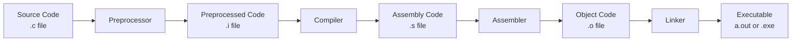

# Module 01: Getting Started with C 🎯

Welcome to your first module in C programming! In this module, you'll learn the absolute basics of C and write your first programs.

## 📚 What You'll Learn

1. What is C and why learn it?
2. Setting up your development environment
3. Understanding the compilation process
4. Writing your first C program
5. Basic input and output operations

## 🎓 Introduction to C Programming

### What is C?

C is a general-purpose, procedural programming language developed by Dennis Ritchie at Bell Labs in 1972. It's one of the most influential programming languages in history and is still widely used today.

### Why Learn C?

- **Foundation**: C is the foundation for many modern languages (C++, C#, Java, etc.)
- **Performance**: C offers excellent performance and low-level control
- **Portability**: C programs can run on virtually any platform
- **System Programming**: Operating systems, embedded systems, and drivers are often written in C
- **Understanding**: Learning C gives you deep understanding of how computers work

### Where is C Used?

- Operating Systems (Linux, Windows kernel components)
- Embedded Systems (IoT devices, microcontrollers)
- Databases (MySQL, PostgreSQL)
- Game Engines
- Scientific Computing
- Network Programming

## 🔧 Setting Up Your Development Environment

### Installing a C Compiler

#### On Linux (Ubuntu/Debian)
```bash
sudo apt update
sudo apt install build-essential
gcc --version
```

#### On macOS
```bash
# Install Xcode Command Line Tools
xcode-select --install
gcc --version
```

#### On Windows
- Install MinGW or use WSL (Windows Subsystem for Linux)
- Or install Visual Studio with C/C++ tools

### Recommended Code Editors

- **VS Code** (Recommended for beginners)
- **CLion** (Professional IDE)
- **Vim/Neovim** (For advanced users)
- **Sublime Text**
- **Atom**

## 📝 The Compilation Process

Understanding how C code becomes an executable is crucial:



### Stages Explained:

1. **Preprocessing**: Handles directives like `#include` and `#define`
2. **Compilation**: Converts C code to assembly language
3. **Assembly**: Converts assembly to machine code (object files)
4. **Linking**: Links object files with libraries to create executable

### Compilation Commands

```bash
# Compile and link in one step
gcc hello.c -o hello

# Step by step
gcc -E hello.c -o hello.i  # Preprocessing only
gcc -S hello.c -o hello.s  # Compilation to assembly
gcc -c hello.c -o hello.o  # Assembly to object file
gcc hello.o -o hello       # Linking
```

## 🚀 Your First C Program

### Hello World

Let's write the most famous program in programming:

```c
#include <stdio.h>

int main() {
    printf("Hello, World!\n");
    return 0;
}
```

### Breaking It Down

- `#include <stdio.h>`: Includes the standard input/output library
- `int main()`: The main function where program execution begins
- `printf()`: Function to print text to the screen
- `\n`: Newline character
- `return 0`: Returns 0 to indicate successful execution

### Compiling and Running

```bash
gcc hello.c -o hello
./hello
```

Output:
```
Hello, World!
```

## 📥 Basic Input and Output

### Output with printf()

```c
#include <stdio.h>

int main() {
    printf("Hello, World!\n");
    printf("My name is Alice\n");
    printf("I am learning C programming\n");
    return 0;
}
```

### Input with scanf()

```c
#include <stdio.h>

int main() {
    int age;
    
    printf("Enter your age: ");
    scanf("%d", &age);
    printf("You are %d years old.\n", age);
    
    return 0;
}
```

### Format Specifiers

- `%d` - Integer
- `%f` - Float
- `%c` - Character
- `%s` - String
- `%lf` - Double

## 📖 Code Examples

Check out these examples in this module:

1. [hello_world.c](./hello_world.c) - Your first C program
2. [hello_user.c](./hello_user.c) - Greeting with user input
3. [basic_io.c](./basic_io.c) - Various input/output examples
4. [compilation_demo.c](./compilation_demo.c) - Demonstrating compilation stages

## ✏️ Exercises

1. Write a program that prints your name, age, and favorite hobby
2. Write a program that asks for two numbers and prints their sum
3. Write a program that displays a simple ASCII art (like a smiley face)
4. Modify the hello world program to print "Hello" 5 times
5. Write a program that takes a user's name and age, then prints a personalized greeting

## 🎯 Key Takeaways

- C programs start execution from the `main()` function
- Every statement in C ends with a semicolon (`;`)
- `#include` is used to include libraries
- `printf()` is for output, `scanf()` is for input
- Always return 0 from main to indicate success
- Comments can be single-line (`//`) or multi-line (`/* */`)

## 🔜 Next Module

Ready to continue? Head to [Module 02: Variables and Data Types](../02-variables-and-types/README.md)

---

**Pro Tip**: Don't just read the code—type it out yourself! This helps build muscle memory and deeper understanding.
