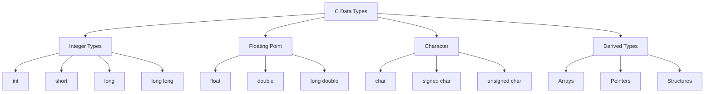

# Module 02: Variables and Data Types 📊

In this module, you'll master variables, data types, and operators in C - the building blocks of any program!

## 📚 What You'll Learn

1. Variables and constants
2. Primitive data types
3. Type conversion and casting
4. All types of operators
5. Pre/post increment and decrement

## 💾 Variables

### What is a Variable?

A variable is a named location in memory that stores a value. Think of it as a labeled box that can hold different values.

### Variable Declaration and Initialization

```c
// Declaration
int age;

// Initialization
age = 25;

// Declaration + Initialization
int height = 180;

// Multiple declarations
int a, b, c;
int x = 5, y = 10, z = 15;
```

### Variable Naming Rules

- Must start with a letter or underscore
- Can contain letters, digits, and underscores
- Case-sensitive (`age` and `Age` are different)
- Cannot use C keywords (like `int`, `return`, etc.)

### Good Variable Names

```c
int student_age;        // Good
int numberOfStudents;   // Good (camelCase)
int score_2023;         // Good

int x;                  // Bad (not descriptive)
int 2students;          // Invalid (starts with digit)
int student-age;        // Invalid (contains hyphen)
```

## 📋 Data Types

### Primitive Data Types



### Integer Types

```c
#include <stdio.h>

int main() {
    char c = 'A';           // 1 byte  (-128 to 127)
    unsigned char uc = 255; // 1 byte  (0 to 255)
    
    short s = 32000;        // 2 bytes (-32,768 to 32,767)
    unsigned short us = 65000; // 2 bytes (0 to 65,535)
    
    int i = 1000000;        // 4 bytes (-2,147,483,648 to 2,147,483,647)
    unsigned int ui = 4000000; // 4 bytes (0 to 4,294,967,295)
    
    long l = 1000000L;      // 4 or 8 bytes
    long long ll = 9000000000LL; // 8 bytes
    
    printf("char: %c (size: %lu bytes)\n", c, sizeof(c));
    printf("int: %d (size: %lu bytes)\n", i, sizeof(i));
    printf("long: %ld (size: %lu bytes)\n", l, sizeof(l));
    printf("long long: %lld (size: %lu bytes)\n", ll, sizeof(ll));
    
    return 0;
}
```

### Floating-Point Types

```c
#include <stdio.h>

int main() {
    float f = 3.14159f;      // 4 bytes (6-7 decimal digits precision)
    double d = 3.14159265359; // 8 bytes (15-16 decimal digits precision)
    long double ld = 3.14159265358979323846L; // 12-16 bytes
    
    printf("float: %.7f (size: %lu bytes)\n", f, sizeof(f));
    printf("double: %.15lf (size: %lu bytes)\n", d, sizeof(d));
    printf("long double: %.18Lf (size: %lu bytes)\n", ld, sizeof(ld));
    
    return 0;
}
```

### Character Type

```c
#include <stdio.h>

int main() {
    char letter = 'A';
    char digit = '5';
    char symbol = '$';
    
    printf("Character: %c, ASCII value: %d\n", letter, letter);
    printf("Character: %c, ASCII value: %d\n", digit, digit);
    printf("Character: %c, ASCII value: %d\n", symbol, symbol);
    
    return 0;
}
```

### Constants

```c
#include <stdio.h>

#define PI 3.14159          // Macro constant
#define MAX_SIZE 100

int main() {
    const int days_in_week = 7;  // const keyword
    const float e = 2.71828;
    
    printf("PI = %f\n", PI);
    printf("Days in week = %d\n", days_in_week);
    
    // days_in_week = 8;  // Error! Cannot modify a const variable
    
    return 0;
}
```

## 🔄 Type Conversion

### Implicit Type Conversion (Automatic)

```c
#include <stdio.h>

int main() {
    int i = 10;
    float f = 3.14;
    double result;
    
    result = i + f;  // int is promoted to float
    printf("Result: %lf\n", result);  // 13.140000
    
    return 0;
}
```

### Explicit Type Conversion (Casting)

```c
#include <stdio.h>

int main() {
    float f = 9.8;
    int i;
    
    i = (int)f;  // Explicit cast
    printf("Float: %f, Int: %d\n", f, i);  // 9.800000, 9
    
    int a = 7, b = 2;
    float division = (float)a / b;  // Cast to get accurate result
    printf("7/2 = %f\n", division);  // 3.500000
    
    return 0;
}
```

## ➕ Operators

### Arithmetic Operators

```c
#include <stdio.h>

int main() {
    int a = 10, b = 3;
    
    printf("a + b = %d\n", a + b);   // Addition: 13
    printf("a - b = %d\n", a - b);   // Subtraction: 7
    printf("a * b = %d\n", a * b);   // Multiplication: 30
    printf("a / b = %d\n", a / b);   // Division: 3 (integer division)
    printf("a %% b = %d\n", a % b);  // Modulus: 1
    
    float x = 10.0, y = 3.0;
    printf("x / y = %.2f\n", x / y); // Float division: 3.33
    
    return 0;
}
```

### Relational Operators

```c
#include <stdio.h>

int main() {
    int a = 10, b = 20;
    
    printf("a == b: %d\n", a == b);  // Equal to: 0 (false)
    printf("a != b: %d\n", a != b);  // Not equal: 1 (true)
    printf("a > b: %d\n", a > b);    // Greater than: 0
    printf("a < b: %d\n", a < b);    // Less than: 1
    printf("a >= b: %d\n", a >= b);  // Greater or equal: 0
    printf("a <= b: %d\n", a <= b);  // Less or equal: 1
    
    return 0;
}
```

### Logical Operators

```c
#include <stdio.h>

int main() {
    int a = 1, b = 0;  // 1 is true, 0 is false
    
    printf("a && b: %d\n", a && b);  // Logical AND: 0
    printf("a || b: %d\n", a || b);  // Logical OR: 1
    printf("!a: %d\n", !a);          // Logical NOT: 0
    
    // Practical example
    int age = 25;
    int has_license = 1;
    
    if (age >= 18 && has_license) {
        printf("Can drive!\n");
    }
    
    return 0;
}
```

### Increment and Decrement Operators

```c
#include <stdio.h>

int main() {
    int a = 5;
    
    printf("a = %d\n", a);      // 5
    printf("a++ = %d\n", a++);  // 5 (post-increment: use then increment)
    printf("a = %d\n", a);      // 6
    
    printf("++a = %d\n", ++a);  // 7 (pre-increment: increment then use)
    printf("a = %d\n", a);      // 7
    
    printf("a-- = %d\n", a--);  // 7 (post-decrement)
    printf("a = %d\n", a);      // 6
    
    printf("--a = %d\n", --a);  // 5 (pre-decrement)
    printf("a = %d\n", a);      // 5
    
    return 0;
}
```

### Bitwise Operators

```c
#include <stdio.h>

int main() {
    unsigned int a = 5;   // Binary: 0101
    unsigned int b = 3;   // Binary: 0011
    
    printf("a & b = %u\n", a & b);   // AND: 0001 = 1
    printf("a | b = %u\n", a | b);   // OR: 0111 = 7
    printf("a ^ b = %u\n", a ^ b);   // XOR: 0110 = 6
    printf("~a = %u\n", ~a);         // NOT: ...1010
    printf("a << 1 = %u\n", a << 1); // Left shift: 1010 = 10
    printf("a >> 1 = %u\n", a >> 1); // Right shift: 0010 = 2
    
    return 0;
}
```

### Assignment Operators

```c
#include <stdio.h>

int main() {
    int a = 10;
    
    a += 5;  // a = a + 5;  => 15
    printf("a += 5: %d\n", a);
    
    a -= 3;  // a = a - 3;  => 12
    printf("a -= 3: %d\n", a);
    
    a *= 2;  // a = a * 2;  => 24
    printf("a *= 2: %d\n", a);
    
    a /= 4;  // a = a / 4;  => 6
    printf("a /= 4: %d\n", a);
    
    a %= 4;  // a = a % 4;  => 2
    printf("a %%= 4: %d\n", a);
    
    return 0;
}
```

## 📖 Code Examples

1. [data_types.c](./data_types.c) - Demonstration of all data types
2. [type_conversion.c](./type_conversion.c) - Type casting examples
3. [operators.c](./operators.c) - All operators in action
4. [increment_decrement.c](./increment_decrement.c) - Pre/post increment/decrement
5. [sizeof_demo.c](./sizeof_demo.c) - Using sizeof operator

## ✏️ Exercises

1. Write a program that swaps two variables without using a third variable
2. Calculate the area and perimeter of a rectangle using float variables
3. Convert temperature from Celsius to Fahrenheit
4. Write a program that demonstrates integer overflow
5. Create a program that uses bitwise operators to check if a number is even or odd
6. Write a program that calculates compound interest

## 🎯 Key Takeaways

- Variables must be declared before use
- Choose appropriate data types to save memory
- Use `const` for values that shouldn't change
- Integer division truncates the decimal part
- Use explicit casting for type conversion when needed
- Pre-increment (`++i`) is slightly more efficient than post-increment (`i++`) in loops
- Bitwise operators work directly on binary representations

## 🔜 Next Module

Ready to learn about control flow? Head to [Module 03: Control Flow](../03-control-flow/README.md)

---

**Remember**: Understanding data types and operators is crucial for writing efficient C programs!
