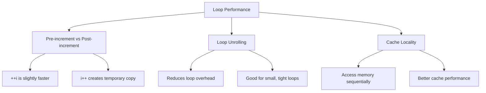

# Module 03: Control Flow 🔀

Master the art of controlling program flow with conditionals and loops!

## 📚 What You'll Learn

1. Conditional statements (if, else, else-if)
2. Switch statements
3. Loops (for, while, do-while)
4. Break and continue statements
5. Nested loops
6. Loop performance considerations

## 🔀 Conditional Statements

### The if Statement

```c
#include <stdio.h>

int main() {
    int age = 20;
    
    if (age >= 18) {
        printf("You are an adult.\n");
    }
    
    return 0;
}
```

### if-else Statement

```c
#include <stdio.h>

int main() {
    int number = 7;
    
    if (number % 2 == 0) {
        printf("%d is even.\n", number);
    } else {
        printf("%d is odd.\n", number);
    }
    
    return 0;
}
```

### if-else-if Ladder

```c
#include <stdio.h>

int main() {
    int score = 85;
    
    if (score >= 90) {
        printf("Grade: A\n");
    } else if (score >= 80) {
        printf("Grade: B\n");
    } else if (score >= 70) {
        printf("Grade: C\n");
    } else if (score >= 60) {
        printf("Grade: D\n");
    } else {
        printf("Grade: F\n");
    }
    
    return 0;
}
```

### Nested if Statements

```c
#include <stdio.h>

int main() {
    int age = 25;
    int has_license = 1;
    
    if (age >= 18) {
        if (has_license) {
            printf("You can drive!\n");
        } else {
            printf("You need a license.\n");
        }
    } else {
        printf("You are too young to drive.\n");
    }
    
    return 0;
}
```

## 🔄 Switch Statement

The switch statement is an alternative to long if-else-if chains:

```c
#include <stdio.h>

int main() {
    int day = 3;
    
    switch (day) {
        case 1:
            printf("Monday\n");
            break;
        case 2:
            printf("Tuesday\n");
            break;
        case 3:
            printf("Wednesday\n");
            break;
        case 4:
            printf("Thursday\n");
            break;
        case 5:
            printf("Friday\n");
            break;
        case 6:
            printf("Saturday\n");
            break;
        case 7:
            printf("Sunday\n");
            break;
        default:
            printf("Invalid day\n");
    }
    
    return 0;
}
```

### Switch without break (Fall-through)

```c
#include <stdio.h>

int main() {
    char grade = 'B';
    
    switch (grade) {
        case 'A':
            printf("Excellent!\n");
            break;
        case 'B':
        case 'C':
            printf("Good job!\n");
            break;
        case 'D':
            printf("You passed.\n");
            break;
        case 'F':
            printf("Better luck next time.\n");
            break;
        default:
            printf("Invalid grade\n");
    }
    
    return 0;
}
```

## ➰ Loops

### for Loop

The for loop is best when you know how many iterations you need:

```c
#include <stdio.h>

int main() {
    // Print numbers 1 to 5
    for (int i = 1; i <= 5; i++) {
        printf("%d ", i);
    }
    printf("\n");
    
    // Print even numbers
    for (int i = 0; i <= 10; i += 2) {
        printf("%d ", i);
    }
    printf("\n");
    
    // Countdown
    for (int i = 5; i > 0; i--) {
        printf("%d ", i);
    }
    printf("Blast off!\n");
    
    return 0;
}
```

### while Loop

Use while when you don't know the exact number of iterations:

```c
#include <stdio.h>

int main() {
    int i = 1;
    
    while (i <= 5) {
        printf("%d ", i);
        i++;
    }
    printf("\n");
    
    // Reading until sentinel value
    int num;
    printf("Enter numbers (0 to stop): ");
    scanf("%d", &num);
    
    while (num != 0) {
        printf("You entered: %d\n", num);
        scanf("%d", &num);
    }
    
    return 0;
}
```

### do-while Loop

The do-while loop always executes at least once:

```c
#include <stdio.h>

int main() {
    int i = 1;
    
    do {
        printf("%d ", i);
        i++;
    } while (i <= 5);
    printf("\n");
    
    // Input validation example
    int age;
    do {
        printf("Enter your age (1-120): ");
        scanf("%d", &age);
        if (age < 1 || age > 120) {
            printf("Invalid age. Try again.\n");
        }
    } while (age < 1 || age > 120);
    
    printf("Your age is: %d\n", age);
    
    return 0;
}
```

## 🎯 Loop Control Statements

### break Statement

Exits the loop immediately:

```c
#include <stdio.h>

int main() {
    for (int i = 1; i <= 10; i++) {
        if (i == 6) {
            break;  // Exit loop when i is 6
        }
        printf("%d ", i);
    }
    printf("\n");  // Output: 1 2 3 4 5
    
    return 0;
}
```

### continue Statement

Skips the rest of the current iteration:

```c
#include <stdio.h>

int main() {
    for (int i = 1; i <= 10; i++) {
        if (i % 2 == 0) {
            continue;  // Skip even numbers
        }
        printf("%d ", i);
    }
    printf("\n");  // Output: 1 3 5 7 9
    
    return 0;
}
```

## 🔁 Nested Loops

Loops inside loops are called nested loops:

```c
#include <stdio.h>

int main() {
    // Print a multiplication table
    for (int i = 1; i <= 5; i++) {
        for (int j = 1; j <= 5; j++) {
            printf("%2d ", i * j);
        }
        printf("\n");
    }
    
    return 0;
}
```

### Pattern Printing

```c
#include <stdio.h>

int main() {
    int rows = 5;
    
    // Right triangle
    printf("Right Triangle:\n");
    for (int i = 1; i <= rows; i++) {
        for (int j = 1; j <= i; j++) {
            printf("* ");
        }
        printf("\n");
    }
    
    printf("\nPyramid:\n");
    for (int i = 1; i <= rows; i++) {
        // Print spaces
        for (int j = 1; j <= rows - i; j++) {
            printf(" ");
        }
        // Print stars
        for (int j = 1; j <= 2 * i - 1; j++) {
            printf("*");
        }
        printf("\n");
    }
    
    return 0;
}
```

## 📊 Loop Performance



### Pre-increment vs Post-increment in Loops

```c
#include <stdio.h>
#include <time.h>

int main() {
    clock_t start, end;
    double cpu_time;
    long long sum = 0;
    const int ITERATIONS = 1000000000;
    
    // Post-increment
    start = clock();
    for (int i = 0; i < ITERATIONS; i++) {
        sum += i;
    }
    end = clock();
    cpu_time = ((double)(end - start)) / CLOCKS_PER_SEC;
    printf("Post-increment (i++): %.4f seconds\n", cpu_time);
    
    // Pre-increment
    sum = 0;
    start = clock();
    for (int i = 0; i < ITERATIONS; ++i) {
        sum += i;
    }
    end = clock();
    cpu_time = ((double)(end - start)) / CLOCKS_PER_SEC;
    printf("Pre-increment (++i): %.4f seconds\n", cpu_time);
    
    return 0;
}
```

## 📖 Code Examples

1. [conditionals.c](./conditionals.c) - if-else examples
2. [switch_demo.c](./switch_demo.c) - Switch statement examples
3. [loops.c](./loops.c) - All loop types
4. [nested_loops.c](./nested_loops.c) - Nested loop patterns
5. [loop_control.c](./loop_control.c) - break and continue
6. [loop_performance.c](./loop_performance.c) - Performance comparisons

## ✏️ Exercises

1. Write a program to find the largest of three numbers
2. Create a simple calculator using switch statement
3. Print the Fibonacci sequence up to n terms
4. Check if a number is prime
5. Print all prime numbers between 1 and 100
6. Create a pattern of a hollow square using nested loops
7. Find the factorial of a number using different loop types
8. Write a program to reverse a number

## 🎯 Key Takeaways

- Use `if-else` for simple conditions, `switch` for multiple discrete values
- `for` loops are best when iteration count is known
- `while` loops are best when iteration count depends on a condition
- `do-while` always executes at least once
- `break` exits the loop entirely
- `continue` skips to the next iteration
- Pre-increment (`++i`) is slightly more efficient than post-increment (`i++`)
- Nested loops can be expensive; optimize when possible

## 🔜 Next Module

Ready to learn about functions? Head to [Module 04: Functions](../04-functions/README.md)

---

**Practice makes perfect!** Try solving all the exercises to master control flow.
