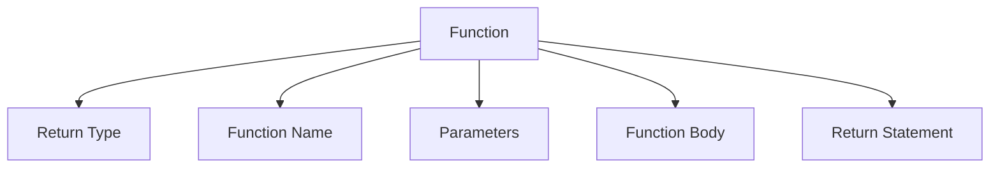
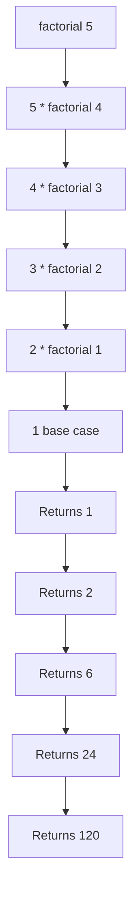

# Module 04: Functions 🔧

Master the art of writing reusable and modular code with functions!

## 📚 What You'll Learn

1. Function declaration and definition
2. Function parameters and return types
3. Scope and lifetime of variables
4. Recursion and recursive algorithms
5. Function pointers
6. Variadic functions

## 🎯 Introduction to Functions

### What is a Function?

A function is a self-contained block of code that performs a specific task. Functions help you:
- **Reusability**: Write once, use many times
- **Modularity**: Break complex problems into smaller parts
- **Maintainability**: Easier to debug and update
- **Abstraction**: Hide implementation details

### Function Anatomy



## 📝 Function Declaration and Definition

### Basic Function Syntax

```c
return_type function_name(parameter_list) {
    // Function body
    // Statements
    return value;
}
```

### Example: Simple Functions

```c
#include <stdio.h>

// Function declaration (prototype)
void greet(void);
int add(int a, int b);

int main() {
    greet();
    int sum = add(5, 3);
    printf("Sum: %d\n", sum);
    return 0;
}

// Function definitions
void greet(void) {
    printf("Hello from a function!\n");
}

int add(int a, int b) {
    return a + b;
}
```

### Function with No Parameters

```c
#include <stdio.h>

int getRandomNumber(void) {
    return 42;  // xkcd reference
}

int main() {
    int num = getRandomNumber();
    printf("Random number: %d\n", num);
    return 0;
}
```

### Function with Multiple Parameters

```c
#include <stdio.h>

float calculateAverage(int a, int b, int c) {
    return (a + b + c) / 3.0;
}

int main() {
    float avg = calculateAverage(10, 20, 30);
    printf("Average: %.2f\n", avg);
    return 0;
}
```

## 🔄 Pass by Value vs Pass by Reference

### Pass by Value

In C, arguments are passed by value by default (a copy is made):

```c
#include <stdio.h>

void tryToModify(int x) {
    x = 100;  // This only modifies the local copy
    printf("Inside function: x = %d\n", x);
}

int main() {
    int num = 10;
    tryToModify(num);
    printf("In main: num = %d\n", num);  // Still 10
    return 0;
}
```

### Pass by Reference (Using Pointers)

```c
#include <stdio.h>

void modify(int *x) {
    *x = 100;  // This modifies the original value
}

void swap(int *a, int *b) {
    int temp = *a;
    *a = *b;
    *b = temp;
}

int main() {
    int num = 10;
    modify(&num);
    printf("num = %d\n", num);  // Now 100
    
    int x = 5, y = 10;
    printf("Before swap: x=%d, y=%d\n", x, y);
    swap(&x, &y);
    printf("After swap: x=%d, y=%d\n", x, y);
    
    return 0;
}
```

## 🌍 Scope and Lifetime

### Local Variables

```c
#include <stdio.h>

void function1() {
    int local = 10;  // Local to function1
    printf("function1: local = %d\n", local);
}

void function2() {
    int local = 20;  // Different local variable
    printf("function2: local = %d\n", local);
}

int main() {
    function1();
    function2();
    // local is not accessible here
    return 0;
}
```

### Global Variables

```c
#include <stdio.h>

int global = 100;  // Global variable

void function() {
    printf("In function: global = %d\n", global);
    global = 200;  // Can modify global
}

int main() {
    printf("In main: global = %d\n", global);
    function();
    printf("After function: global = %d\n", global);
    return 0;
}
```

### Static Variables

```c
#include <stdio.h>

void counter() {
    static int count = 0;  // Initialized only once
    count++;
    printf("Function called %d times\n", count);
}

int main() {
    counter();  // 1
    counter();  // 2
    counter();  // 3
    return 0;
}
```

## 🔁 Recursion

### What is Recursion?

Recursion is when a function calls itself. Every recursive function needs:
1. **Base case**: Condition to stop recursion
2. **Recursive case**: Function calls itself with modified parameters

### Classic Example: Factorial



```c
#include <stdio.h>

int factorial(int n) {
    // Base case
    if (n <= 1) {
        return 1;
    }
    // Recursive case
    return n * factorial(n - 1);
}

int main() {
    int num = 5;
    printf("Factorial of %d is %d\n", num, factorial(num));
    return 0;
}
```

### Fibonacci Sequence

```c
#include <stdio.h>

int fibonacci(int n) {
    if (n <= 1) {
        return n;
    }
    return fibonacci(n - 1) + fibonacci(n - 2);
}

int main() {
    printf("First 10 Fibonacci numbers:\n");
    for (int i = 0; i < 10; i++) {
        printf("%d ", fibonacci(i));
    }
    printf("\n");
    return 0;
}
```

### Tower of Hanoi

```c
#include <stdio.h>

void towerOfHanoi(int n, char from, char to, char aux) {
    if (n == 1) {
        printf("Move disk 1 from %c to %c\n", from, to);
        return;
    }
    towerOfHanoi(n - 1, from, aux, to);
    printf("Move disk %d from %c to %c\n", n, from, to);
    towerOfHanoi(n - 1, aux, to, from);
}

int main() {
    int n = 3;
    printf("Tower of Hanoi with %d disks:\n", n);
    towerOfHanoi(n, 'A', 'C', 'B');
    return 0;
}
```

### Recursion vs Iteration

```c
#include <stdio.h>

// Recursive sum
int sumRecursive(int n) {
    if (n <= 0) return 0;
    return n + sumRecursive(n - 1);
}

// Iterative sum
int sumIterative(int n) {
    int sum = 0;
    for (int i = 1; i <= n; i++) {
        sum += i;
    }
    return sum;
}

int main() {
    int n = 100;
    printf("Sum (recursive): %d\n", sumRecursive(n));
    printf("Sum (iterative): %d\n", sumIterative(n));
    return 0;
}
```

## 🎯 Function Pointers

Function pointers allow you to store and call functions dynamically:

```c
#include <stdio.h>

int add(int a, int b) { return a + b; }
int subtract(int a, int b) { return a - b; }
int multiply(int a, int b) { return a * b; }

int main() {
    // Declare function pointer
    int (*operation)(int, int);
    
    // Point to add function
    operation = add;
    printf("5 + 3 = %d\n", operation(5, 3));
    
    // Point to subtract function
    operation = subtract;
    printf("5 - 3 = %d\n", operation(5, 3));
    
    // Point to multiply function
    operation = multiply;
    printf("5 * 3 = %d\n", operation(5, 3));
    
    return 0;
}
```

### Callback Functions

```c
#include <stdio.h>

void forEach(int arr[], int size, void (*callback)(int)) {
    for (int i = 0; i < size; i++) {
        callback(arr[i]);
    }
}

void printDouble(int n) {
    printf("%d ", n * 2);
}

void printSquare(int n) {
    printf("%d ", n * n);
}

int main() {
    int numbers[] = {1, 2, 3, 4, 5};
    int size = sizeof(numbers) / sizeof(numbers[0]);
    
    printf("Doubles: ");
    forEach(numbers, size, printDouble);
    printf("\n");
    
    printf("Squares: ");
    forEach(numbers, size, printSquare);
    printf("\n");
    
    return 0;
}
```

## 📖 Code Examples

Check out these examples in this module:

1. [basic_functions.c](./basic_functions.c) - Function basics
2. [pass_by_value_reference.c](./pass_by_value_reference.c) - Parameter passing
3. [recursion_examples.c](./recursion_examples.c) - Various recursive functions
4. [function_pointers.c](./function_pointers.c) - Function pointer examples
5. [scope_lifetime.c](./scope_lifetime.c) - Variable scope demonstration

## ✏️ Exercises

1. Write a function to check if a number is prime
2. Create a function to find the GCD of two numbers (using Euclid's algorithm)
3. Write a recursive function to reverse a string
4. Implement a function to calculate power (x^n) using recursion
5. Create a calculator program using function pointers
6. Write a recursive function to print a number in binary
7. Implement merge sort using recursion
8. Create a function that returns multiple values using pointers

## 🎯 Key Takeaways

- Functions make code reusable and maintainable
- Always declare functions before using them (prototypes)
- C uses pass-by-value by default; use pointers for pass-by-reference
- Local variables are destroyed when function returns
- Static variables retain their value between function calls
- Every recursive function must have a base case
- Function pointers enable dynamic function calls
- Recursion can be elegant but may be less efficient than iteration

## 🔜 Next Module

Ready to dive into arrays and strings? Head to [Module 05: Arrays and Strings](../05-arrays-and-strings/README.md)

---

**Pro Tip**: Master recursion by drawing the call stack on paper. It helps visualize how the function calls itself and returns values!
