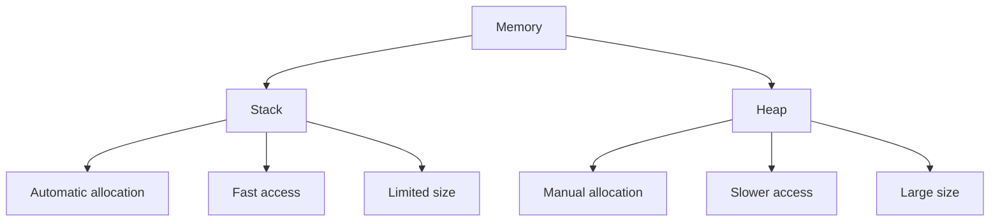

# Module 07: Advanced Memory Management 💾

Master dynamic memory allocation and avoid memory leaks!

## 📚 What You'll Learn

1. Stack vs Heap memory
2. Dynamic memory allocation (malloc, calloc, realloc, free)
3. Memory leaks and debugging
4. Custom memory allocators
5. Best practices

## 🗂️ Stack vs Heap



## 💾 Dynamic Allocation

```c
#include <stdio.h>
#include <stdlib.h>

int main() {
    // malloc - allocate uninitialized memory
    int *arr = (int*)malloc(5 * sizeof(int));
    if (arr == NULL) {
        printf("Memory allocation failed!\n");
        return 1;
    }
    
    // calloc - allocate zero-initialized memory
    int *arr2 = (int*)calloc(5, sizeof(int));
    
    // realloc - resize memory
    arr = (int*)realloc(arr, 10 * sizeof(int));
    
    // Always free allocated memory
    free(arr);
    free(arr2);
    
    return 0;
}
```

## 🐛 Common Memory Errors

1. **Memory leak**: Forgetting to free
2. **Double free**: Freeing twice
3. **Use after free**: Using freed memory
4. **Buffer overflow**: Writing beyond bounds
5. **Null pointer dereference**: Using NULL pointer

## 🔜 Next Module

[Module 08: Structures and Unions](../08-structures-unions/README.md)
