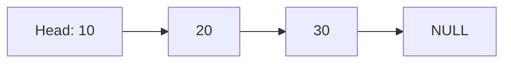
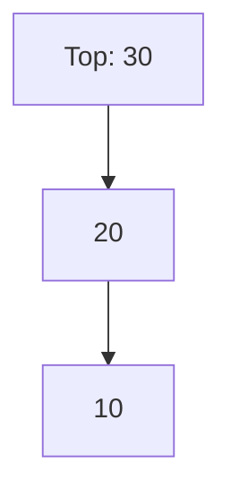
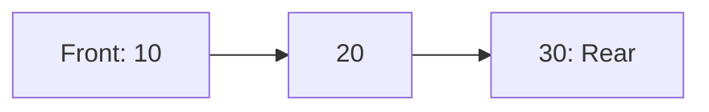

# Module 11: Data Structures Fundamentals 🗂️

Build essential data structures from scratch!

## 📚 What You'll Learn

1. Linked lists (Singly, Doubly, Circular)
2. Stacks and Queues
3. Hash tables
4. Implementation and complexity analysis
5. Visualization with Mermaid diagrams

## 🔗 Singly Linked List



```c
#include <stdio.h>
#include <stdlib.h>

typedef struct Node {
    int data;
    struct Node *next;
} Node;

Node* createNode(int data) {
    Node *newNode = (Node*)malloc(sizeof(Node));
    newNode->data = data;
    newNode->next = NULL;
    return newNode;
}

void insertAtEnd(Node **head, int data) {
    Node *newNode = createNode(data);
    if (*head == NULL) {
        *head = newNode;
        return;
    }
    Node *temp = *head;
    while (temp->next != NULL) {
        temp = temp->next;
    }
    temp->next = newNode;
}

void printList(Node *head) {
    while (head != NULL) {
        printf("%d -> ", head->data);
        head = head->next;
    }
    printf("NULL\n");
}
```

## 📚 Stack (LIFO)



```c
typedef struct {
    int data[100];
    int top;
} Stack;

void push(Stack *s, int value) {
    if (s->top < 99) {
        s->data[++s->top] = value;
    }
}

int pop(Stack *s) {
    if (s->top >= 0) {
        return s->data[s->top--];
    }
    return -1;
}
```

## 🔄 Queue (FIFO)



```c
typedef struct {
    int data[100];
    int front, rear;
} Queue;

void enqueue(Queue *q, int value) {
    if (q->rear < 99) {
        q->data[++q->rear] = value;
    }
}

int dequeue(Queue *q) {
    if (q->front <= q->rear) {
        return q->data[q->front++];
    }
    return -1;
}
```

## 🗃️ Hash Table

```c
#define TABLE_SIZE 100

typedef struct {
    int key;
    int value;
    int occupied;
} HashEntry;

typedef struct {
    HashEntry entries[TABLE_SIZE];
} HashTable;

int hash(int key) {
    return key % TABLE_SIZE;
}

void insert(HashTable *ht, int key, int value) {
    int index = hash(key);
    while (ht->entries[index].occupied) {
        index = (index + 1) % TABLE_SIZE;
    }
    ht->entries[index].key = key;
    ht->entries[index].value = value;
    ht->entries[index].occupied = 1;
}
```

## 🔜 Next Module

[Module 12: Advanced Data Structures](../12-advanced-data-structures/README.md)
