# Module 12: Advanced Data Structures 🌳

Master complex data structures with comprehensive visualizations and implementations!

## 📚 What You'll Learn

1. Binary Trees and Binary Search Trees
2. AVL Trees and Balanced Trees
3. Graphs (Representation and Traversal)
4. Tries and Suffix Trees
5. Heaps and Priority Queues
6. Complete DSA with Visual Diagrams

## 🌳 Binary Search Trees

### BST Structure


### BST Implementation

```c
#include <stdio.h>
#include <stdlib.h>

typedef struct Node {
    int data;
    struct Node *left;
    struct Node *right;
} Node;

Node* createNode(int data) {
    Node *newNode = (Node*)malloc(sizeof(Node));
    newNode->data = data;
    newNode->left = NULL;
    newNode->right = NULL;
    return newNode;
}

Node* insert(Node *root, int data) {
    if (root == NULL) {
        return createNode(data);
    }
    
    if (data < root->data) {
        root->left = insert(root->left, data);
    } else if (data > root->data) {
        root->right = insert(root->right, data);
    }
    
    return root;
}

Node* search(Node *root, int data) {
    if (root == NULL || root->data == data) {
        return root;
    }
    
    if (data < root->data) {
        return search(root->left, data);
    }
    return search(root->right, data);
}

void inorder(Node *root) {
    if (root != NULL) {
        inorder(root->left);
        printf("%d ", root->data);
        inorder(root->right);
    }
}

void preorder(Node *root) {
    if (root != NULL) {
        printf("%d ", root->data);
        preorder(root->left);
        preorder(root->right);
    }
}

void postorder(Node *root) {
    if (root != NULL) {
        postorder(root->left);
        postorder(root->right);
        printf("%d ", root->data);
    }
}
```

### Tree Traversals Visualization

```mermaid
graph TD
    A[Tree Traversals] --> B[Inorder]
    A --> C[Preorder]
    A --> D[Postorder]
    B --> B1[Left → Root → Right]
    C --> C1[Root → Left → Right]
    D --> D1[Left → Right → Root]
    B1 --> B2["Sorted Order for BST"]
    C1 --> C2["Copy Tree"]
    D1 --> D2["Delete Tree"]
```



## 📊 Graphs

### Graph Representations

```mermaid
graph LR
    A[Graph Representations] --> B[Adjacency Matrix]
    A --> C[Adjacency List]
    B --> B1["O(V²) space"]
    B --> B2["O(1) edge lookup"]
    C --> C1["O(V+E) space"]
    C --> C2["O(degree) lookup"]
```



### Graph Implementation (Adjacency List)

```c
#include <stdio.h>
#include <stdlib.h>

#define MAX_VERTICES 100

typedef struct Node {
    int vertex;
    struct Node *next;
} Node;

typedef struct Graph {
    int numVertices;
    Node **adjLists;
    int *visited;
} Graph;

Graph* createGraph(int vertices) {
    Graph *graph = (Graph*)malloc(sizeof(Graph));
    graph->numVertices = vertices;
    
    graph->adjLists = (Node**)malloc(vertices * sizeof(Node*));
    graph->visited = (int*)malloc(vertices * sizeof(int));
    
    for (int i = 0; i < vertices; i++) {
        graph->adjLists[i] = NULL;
        graph->visited[i] = 0;
    }
    
    return graph;
}

Node* createNode(int v) {
    Node *newNode = (Node*)malloc(sizeof(Node));
    newNode->vertex = v;
    newNode->next = NULL;
    return newNode;
}

void addEdge(Graph *graph, int src, int dest) {
    // Add edge from src to dest
    Node *newNode = createNode(dest);
    newNode->next = graph->adjLists[src];
    graph->adjLists[src] = newNode;
    
    // Add edge from dest to src (for undirected graph)
    newNode = createNode(src);
    newNode->next = graph->adjLists[dest];
    graph->adjLists[dest] = newNode;
}

void DFS(Graph *graph, int vertex) {
    Node *adjList = graph->adjLists[vertex];
    Node *temp = adjList;
    
    graph->visited[vertex] = 1;
    printf("%d ", vertex);
    
    while (temp != NULL) {
        int connectedVertex = temp->vertex;
        if (graph->visited[connectedVertex] == 0) {
            DFS(graph, connectedVertex);
        }
        temp = temp->next;
    }
}

void BFS(Graph *graph, int startVertex) {
    int queue[MAX_VERTICES];
    int front = 0, rear = 0;
    
    graph->visited[startVertex] = 1;
    queue[rear++] = startVertex;
    
    while (front < rear) {
        int currentVertex = queue[front++];
        printf("%d ", currentVertex);
        
        Node *temp = graph->adjLists[currentVertex];
        while (temp != NULL) {
            int adjVertex = temp->vertex;
            if (graph->visited[adjVertex] == 0) {
                graph->visited[adjVertex] = 1;
                queue[rear++] = adjVertex;
            }
            temp = temp->next;
        }
    }
}
```

### Graph Traversal Visualization


## 🔍 Tries

### Trie Structure


### Trie Implementation

```c
#include <stdio.h>
#include <stdlib.h>
#include <stdbool.h>
#include <string.h>

#define ALPHABET_SIZE 26

typedef struct TrieNode {
    struct TrieNode *children[ALPHABET_SIZE];
    bool isEndOfWord;
} TrieNode;

TrieNode* createNode() {
    TrieNode *node = (TrieNode*)malloc(sizeof(TrieNode));
    node->isEndOfWord = false;
    
    for (int i = 0; i < ALPHABET_SIZE; i++) {
        node->children[i] = NULL;
    }
    
    return node;
}

void insert(TrieNode *root, const char *key) {
    TrieNode *current = root;
    
    for (int i = 0; key[i] != '\0'; i++) {
        int index = key[i] - 'a';
        
        if (current->children[index] == NULL) {
            current->children[index] = createNode();
        }
        
        current = current->children[index];
    }
    
    current->isEndOfWord = true;
}

bool search(TrieNode *root, const char *key) {
    TrieNode *current = root;
    
    for (int i = 0; key[i] != '\0'; i++) {
        int index = key[i] - 'a';
        
        if (current->children[index] == NULL) {
            return false;
        }
        
        current = current->children[index];
    }
    
    return current != NULL && current->isEndOfWord;
}

bool startsWith(TrieNode *root, const char *prefix) {
    TrieNode *current = root;
    
    for (int i = 0; prefix[i] != '\0'; i++) {
        int index = prefix[i] - 'a';
        
        if (current->children[index] == NULL) {
            return false;
        }
        
        current = current->children[index];
    }
    
    return true;
}
```

## 🏔️ Heaps

### Max Heap Structure


### Heap Implementation

```c
#include <stdio.h>
#include <stdlib.h>

typedef struct MaxHeap {
    int *arr;
    int size;
    int capacity;
} MaxHeap;

MaxHeap* createHeap(int capacity) {
    MaxHeap *heap = (MaxHeap*)malloc(sizeof(MaxHeap));
    heap->size = 0;
    heap->capacity = capacity;
    heap->arr = (int*)malloc(capacity * sizeof(int));
    return heap;
}

void swap(int *a, int *b) {
    int temp = *a;
    *a = *b;
    *b = temp;
}

int parent(int i) { return (i - 1) / 2; }
int leftChild(int i) { return 2 * i + 1; }
int rightChild(int i) { return 2 * i + 2; }

void heapifyUp(MaxHeap *heap, int index) {
    while (index > 0 && heap->arr[parent(index)] < heap->arr[index]) {
        swap(&heap->arr[parent(index)], &heap->arr[index]);
        index = parent(index);
    }
}

void heapifyDown(MaxHeap *heap, int index) {
    int maxIndex = index;
    int left = leftChild(index);
    int right = rightChild(index);
    
    if (left < heap->size && heap->arr[left] > heap->arr[maxIndex]) {
        maxIndex = left;
    }
    
    if (right < heap->size && heap->arr[right] > heap->arr[maxIndex]) {
        maxIndex = right;
    }
    
    if (index != maxIndex) {
        swap(&heap->arr[index], &heap->arr[maxIndex]);
        heapifyDown(heap, maxIndex);
    }
}

void insert(MaxHeap *heap, int value) {
    if (heap->size == heap->capacity) {
        printf("Heap is full!\n");
        return;
    }
    
    heap->arr[heap->size] = value;
    heap->size++;
    heapifyUp(heap, heap->size - 1);
}

int extractMax(MaxHeap *heap) {
    if (heap->size == 0) {
        printf("Heap is empty!\n");
        return -1;
    }
    
    int max = heap->arr[0];
    heap->arr[0] = heap->arr[heap->size - 1];
    heap->size--;
    heapifyDown(heap, 0);
    
    return max;
}
```

## 📖 Code Examples

1. [bst.c](./bst.c) - Binary Search Tree implementation
2. [graph.c](./graph.c) - Graph with DFS and BFS
3. [trie.c](./trie.c) - Trie for string operations
4. [heap.c](./heap.c) - Max/Min heap implementation
5. [avl_tree.c](./avl_tree.c) - Self-balancing AVL tree

## ✏️ Exercises

1. Implement tree deletion in BST
2. Find the lowest common ancestor in BST
3. Implement Dijkstra's shortest path algorithm
4. Detect cycle in a graph
5. Implement autocomplete using Trie
6. Build a heap from an array
7. Implement topological sort
8. Find connected components in graph

## 🎯 Key Takeaways

- BST provides O(log n) search in balanced case
- Graphs can represent complex relationships
- Tries are excellent for prefix-based searches
- Heaps provide O(1) access to max/min element
- Choose data structure based on operation requirements
- Visualizations help understand complex structures

## 🔜 Next Module

Ready to debug like a pro? Head to [Module 13: Debugging with GDB](../13-debugging-gdb/README.md)

---

**Pro Tip**: Draw the data structure on paper before implementing. It helps catch edge cases!
