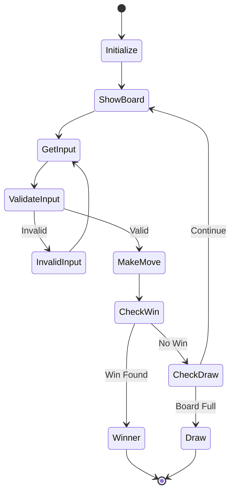
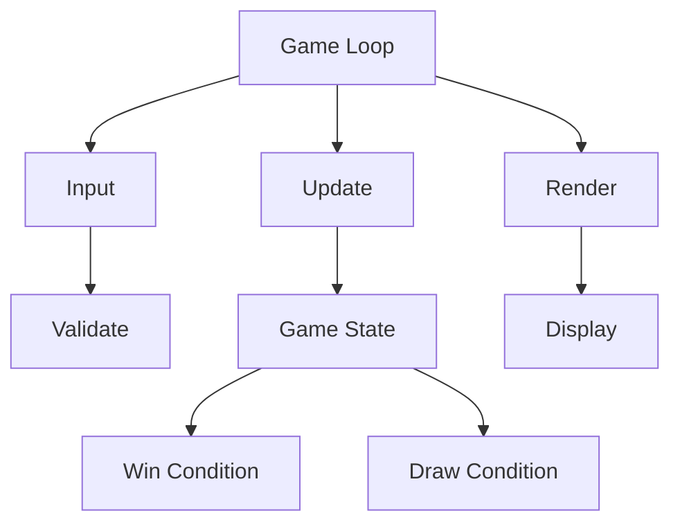
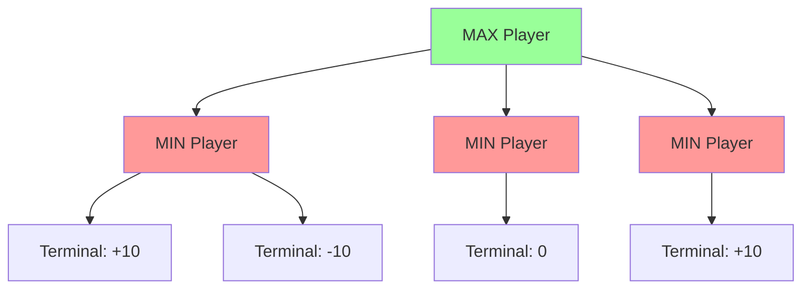

# Module 15: Game Development Projects 🎮

Learn game development concepts by building fun projects in C!

## 📚 What You'll Learn

1. Console-based game development
2. Game loop and state management
3. User input handling
4. AI for games (Minimax algorithm)
5. Simple game physics

## 🎯 Project 1: Tic-Tac-Toe

### Game Overview

A complete implementation of Tic-Tac-Toe with:
- Human vs Human mode
- Human vs Computer mode
- AI using Minimax algorithm
- Input validation
- Win detection

### Game State Diagram



### Complete Tic-Tac-Toe Implementation

See [tictactoe.c](./tictactoe.c) for the full implementation with:
- Board representation
- Move validation
- Win checking
- AI opponent
- Game loop

### Key Concepts



## 🎮 Project 2: Snake Game

### Snake Game Structure

```c
#include <stdio.h>
#include <stdlib.h>
#include <time.h>

#define WIDTH 20
#define HEIGHT 20

typedef struct {
    int x, y;
} Point;

typedef struct {
    Point body[100];
    int length;
    int dx, dy;
} Snake;

typedef struct {
    Point food;
    Snake snake;
    int score;
    int gameOver;
} GameState;

void initGame(GameState *game);
void updateGame(GameState *game);
void drawGame(GameState *game);
int checkCollision(Snake *snake);
void generateFood(GameState *game);
```

## 🎲 Project 3: Simple Sudoku Solver

### Sudoku Solver Using Backtracking

```c
#include <stdio.h>
#include <stdbool.h>

#define N 9

bool isSafe(int grid[N][N], int row, int col, int num) {
    // Check row
    for (int x = 0; x < N; x++) {
        if (grid[row][x] == num) return false;
    }
    
    // Check column
    for (int x = 0; x < N; x++) {
        if (grid[x][col] == num) return false;
    }
    
    // Check 3x3 box
    int startRow = row - row % 3;
    int startCol = col - col % 3;
    for (int i = 0; i < 3; i++) {
        for (int j = 0; j < 3; j++) {
            if (grid[i + startRow][j + startCol] == num) {
                return false;
            }
        }
    }
    
    return true;
}

bool solveSudoku(int grid[N][N], int row, int col) {
    if (row == N - 1 && col == N) return true;
    if (col == N) {
        row++;
        col = 0;
    }
    
    if (grid[row][col] != 0) {
        return solveSudoku(grid, row, col + 1);
    }
    
    for (int num = 1; num <= N; num++) {
        if (isSafe(grid, row, col, num)) {
            grid[row][col] = num;
            if (solveSudoku(grid, row, col + 1)) {
                return true;
            }
            grid[row][col] = 0;
        }
    }
    
    return false;
}
```

## 🎯 AI: Minimax Algorithm

### Minimax for Tic-Tac-Toe



```c
#include <stdio.h>
#include <limits.h>

int minimax(char board[3][3], int depth, int isMax) {
    int score = evaluateBoard(board);
    
    // Terminal states
    if (score == 10) return score - depth;
    if (score == -10) return score + depth;
    if (!isMovesLeft(board)) return 0;
    
    if (isMax) {
        int best = INT_MIN;
        for (int i = 0; i < 3; i++) {
            for (int j = 0; j < 3; j++) {
                if (board[i][j] == ' ') {
                    board[i][j] = 'X';
                    int val = minimax(board, depth + 1, 0);
                    best = (val > best) ? val : best;
                    board[i][j] = ' ';
                }
            }
        }
        return best;
    } else {
        int best = INT_MAX;
        for (int i = 0; i < 3; i++) {
            for (int j = 0; j < 3; j++) {
                if (board[i][j] == ' ') {
                    board[i][j] = 'O';
                    int val = minimax(board, depth + 1, 1);
                    best = (val < best) ? val : best;
                    board[i][j] = ' ';
                }
            }
        }
        return best;
    }
}

void findBestMove(char board[3][3]) {
    int bestVal = INT_MIN;
    int bestRow = -1, bestCol = -1;
    
    for (int i = 0; i < 3; i++) {
        for (int j = 0; j < 3; j++) {
            if (board[i][j] == ' ') {
                board[i][j] = 'X';
                int moveVal = minimax(board, 0, 0);
                board[i][j] = ' ';
                
                if (moveVal > bestVal) {
                    bestRow = i;
                    bestCol = j;
                    bestVal = moveVal;
                }
            }
        }
    }
    
    printf("Best move: (%d, %d)\n", bestRow, bestCol);
}
```

## 📖 Code Examples

1. [tictactoe.c](./tictactoe.c) - Complete Tic-Tac-Toe game
2. [tictactoe_ai.c](./tictactoe_ai.c) - Tic-Tac-Toe with AI
3. [snake.c](./snake.c) - Snake game
4. [sudoku_solver.c](./sudoku_solver.c) - Sudoku solver
5. [game_utils.c](./game_utils.c) - Common game utilities

## ✏️ Exercises

1. Add difficulty levels to Tic-Tac-Toe AI
2. Implement score tracking across multiple games
3. Create a 4x4 Tic-Tac-Toe variant
4. Add obstacles to the Snake game
5. Create a simple maze game
6. Implement Conway's Game of Life
7. Create a number guessing game with hints
8. Build a text-based adventure game

## 🎯 Key Takeaways

- Game loop: Input → Update → Render
- State management is crucial
- Input validation prevents crashes
- AI can use algorithms like Minimax
- Keep code modular for easy testing
- User experience matters even in console games

## 🔜 Next Module

Ready to network? Head to [Module 16: Network Programming](../16-network-programming/README.md)

---

**Pro Tip**: Start with simple games and gradually add features. Test each feature thoroughly!
