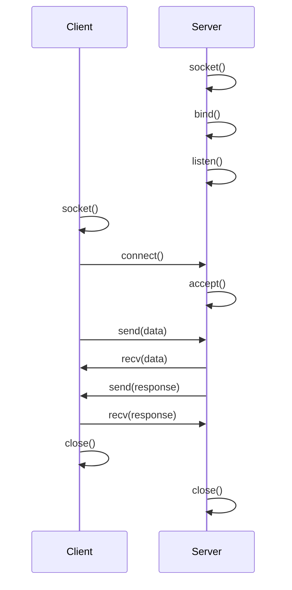

# Module 16: Network Programming 🌐

Master socket programming and network communication in C!

## 📚 What You'll Learn

1. Socket programming basics
2. TCP/IP communication
3. UDP programming
4. HTTP client/server implementation
5. Multi-threaded servers

## 🌐 Socket Programming Basics

### Client-Server Architecture



## 🔌 TCP Server

### Simple TCP Echo Server

```c
#include <stdio.h>
#include <stdlib.h>
#include <string.h>
#include <unistd.h>
#include <arpa/inet.h>

#define PORT 8080
#define BUFFER_SIZE 1024

int main() {
    int server_fd, client_fd;
    struct sockaddr_in address;
    int addrlen = sizeof(address);
    char buffer[BUFFER_SIZE] = {0};
    
    // Create socket
    if ((server_fd = socket(AF_INET, SOCK_STREAM, 0)) == 0) {
        perror("Socket failed");
        exit(EXIT_FAILURE);
    }
    
    // Configure address
    address.sin_family = AF_INET;
    address.sin_addr.s_addr = INADDR_ANY;
    address.sin_port = htons(PORT);
    
    // Bind socket
    if (bind(server_fd, (struct sockaddr *)&address, sizeof(address)) < 0) {
        perror("Bind failed");
        exit(EXIT_FAILURE);
    }
    
    // Listen for connections
    if (listen(server_fd, 3) < 0) {
        perror("Listen failed");
        exit(EXIT_FAILURE);
    }
    
    printf("Server listening on port %d...\n", PORT);
    
    // Accept connection
    if ((client_fd = accept(server_fd, (struct sockaddr *)&address, 
                           (socklen_t*)&addrlen)) < 0) {
        perror("Accept failed");
        exit(EXIT_FAILURE);
    }
    
    // Receive and echo data
    while (1) {
        memset(buffer, 0, BUFFER_SIZE);
        int valread = read(client_fd, buffer, BUFFER_SIZE);
        if (valread <= 0) break;
        
        printf("Client: %s\n", buffer);
        send(client_fd, buffer, strlen(buffer), 0);
    }
    
    close(client_fd);
    close(server_fd);
    
    return 0;
}
```

## 💻 TCP Client

### Simple TCP Client

```c
#include <stdio.h>
#include <stdlib.h>
#include <string.h>
#include <unistd.h>
#include <arpa/inet.h>

#define PORT 8080
#define BUFFER_SIZE 1024

int main() {
    int sock = 0;
    struct sockaddr_in serv_addr;
    char buffer[BUFFER_SIZE] = {0};
    char message[BUFFER_SIZE];
    
    // Create socket
    if ((sock = socket(AF_INET, SOCK_STREAM, 0)) < 0) {
        printf("Socket creation error\n");
        return -1;
    }
    
    serv_addr.sin_family = AF_INET;
    serv_addr.sin_port = htons(PORT);
    
    // Convert address
    if (inet_pton(AF_INET, "127.0.0.1", &serv_addr.sin_addr) <= 0) {
        printf("Invalid address\n");
        return -1;
    }
    
    // Connect to server
    if (connect(sock, (struct sockaddr *)&serv_addr, sizeof(serv_addr)) < 0) {
        printf("Connection Failed\n");
        return -1;
    }
    
    printf("Connected to server!\n");
    
    while (1) {
        printf("You: ");
        fgets(message, BUFFER_SIZE, stdin);
        
        // Send message
        send(sock, message, strlen(message), 0);
        
        // Receive echo
        memset(buffer, 0, BUFFER_SIZE);
        read(sock, buffer, BUFFER_SIZE);
        printf("Server: %s\n", buffer);
    }
    
    close(sock);
    return 0;
}
```

## 📡 UDP Programming

### UDP Server

```c
#include <stdio.h>
#include <stdlib.h>
#include <string.h>
#include <unistd.h>
#include <arpa/inet.h>

#define PORT 8080
#define BUFFER_SIZE 1024

int main() {
    int sockfd;
    char buffer[BUFFER_SIZE];
    struct sockaddr_in servaddr, cliaddr;
    socklen_t len = sizeof(cliaddr);
    
    // Create UDP socket
    sockfd = socket(AF_INET, SOCK_DGRAM, 0);
    
    memset(&servaddr, 0, sizeof(servaddr));
    memset(&cliaddr, 0, sizeof(cliaddr));
    
    servaddr.sin_family = AF_INET;
    servaddr.sin_addr.s_addr = INADDR_ANY;
    servaddr.sin_port = htons(PORT);
    
    // Bind socket
    bind(sockfd, (const struct sockaddr *)&servaddr, sizeof(servaddr));
    
    printf("UDP Server listening on port %d...\n", PORT);
    
    while (1) {
        memset(buffer, 0, BUFFER_SIZE);
        
        // Receive datagram
        recvfrom(sockfd, buffer, BUFFER_SIZE, 0,
                (struct sockaddr *)&cliaddr, &len);
        printf("Client: %s\n", buffer);
        
        // Send response
        sendto(sockfd, buffer, strlen(buffer), 0,
              (const struct sockaddr *)&cliaddr, len);
    }
    
    close(sockfd);
    return 0;
}
```

## 🌐 HTTP Server

### Simple HTTP Server

```c
#include <stdio.h>
#include <stdlib.h>
#include <string.h>
#include <unistd.h>
#include <arpa/inet.h>

#define PORT 8080
#define BUFFER_SIZE 4096

const char *HTTP_RESPONSE = 
    "HTTP/1.1 200 OK\r\n"
    "Content-Type: text/html\r\n"
    "Content-Length: %d\r\n"
    "\r\n"
    "%s";

const char *HTML_PAGE = 
    "<!DOCTYPE html>"
    "<html>"
    "<head><title>Simple HTTP Server</title></head>"
    "<body>"
    "<h1>Hello from C HTTP Server!</h1>"
    "<p>This is a simple HTTP server written in C.</p>"
    "</body>"
    "</html>";

int main() {
    int server_fd, client_fd;
    struct sockaddr_in address;
    int addrlen = sizeof(address);
    char buffer[BUFFER_SIZE];
    char response[BUFFER_SIZE];
    
    // Create socket
    server_fd = socket(AF_INET, SOCK_STREAM, 0);
    
    address.sin_family = AF_INET;
    address.sin_addr.s_addr = INADDR_ANY;
    address.sin_port = htons(PORT);
    
    // Bind and listen
    bind(server_fd, (struct sockaddr *)&address, sizeof(address));
    listen(server_fd, 10);
    
    printf("HTTP Server running on http://localhost:%d\n", PORT);
    
    while (1) {
        client_fd = accept(server_fd, (struct sockaddr *)&address,
                          (socklen_t*)&addrlen);
        
        // Read request
        memset(buffer, 0, BUFFER_SIZE);
        read(client_fd, buffer, BUFFER_SIZE);
        printf("Request:\n%s\n", buffer);
        
        // Send response
        int content_length = strlen(HTML_PAGE);
        snprintf(response, BUFFER_SIZE, HTTP_RESPONSE, 
                content_length, HTML_PAGE);
        write(client_fd, response, strlen(response));
        
        close(client_fd);
    }
    
    close(server_fd);
    return 0;
}
```

## 🧵 Multi-threaded Server

### Threaded TCP Server

```c
#include <stdio.h>
#include <stdlib.h>
#include <string.h>
#include <unistd.h>
#include <pthread.h>
#include <arpa/inet.h>

#define PORT 8080
#define BUFFER_SIZE 1024

void *handleClient(void *arg) {
    int client_fd = *(int*)arg;
    char buffer[BUFFER_SIZE];
    
    while (1) {
        memset(buffer, 0, BUFFER_SIZE);
        int valread = read(client_fd, buffer, BUFFER_SIZE);
        if (valread <= 0) break;
        
        printf("Client %d: %s\n", client_fd, buffer);
        send(client_fd, buffer, strlen(buffer), 0);
    }
    
    close(client_fd);
    free(arg);
    return NULL;
}

int main() {
    int server_fd, client_fd;
    struct sockaddr_in address;
    int addrlen = sizeof(address);
    pthread_t thread_id;
    
    server_fd = socket(AF_INET, SOCK_STREAM, 0);
    
    address.sin_family = AF_INET;
    address.sin_addr.s_addr = INADDR_ANY;
    address.sin_port = htons(PORT);
    
    bind(server_fd, (struct sockaddr *)&address, sizeof(address));
    listen(server_fd, 10);
    
    printf("Multi-threaded server listening on port %d...\n", PORT);
    
    while (1) {
        client_fd = accept(server_fd, (struct sockaddr *)&address,
                          (socklen_t*)&addrlen);
        printf("New client connected: %d\n", client_fd);
        
        int *pclient = malloc(sizeof(int));
        *pclient = client_fd;
        
        pthread_create(&thread_id, NULL, handleClient, pclient);
        pthread_detach(thread_id);
    }
    
    close(server_fd);
    return 0;
}
```

## 📖 Code Examples

1. [tcp_server.c](./tcp_server.c) - TCP echo server
2. [tcp_client.c](./tcp_client.c) - TCP client
3. [udp_server.c](./udp_server.c) - UDP server
4. [http_server.c](./http_server.c) - Simple HTTP server
5. [threaded_server.c](./threaded_server.c) - Multi-threaded server

## ✏️ Exercises

1. Implement a chat server with multiple clients
2. Create a file transfer protocol
3. Build an HTTP client to fetch web pages
4. Implement a simple DNS client
5. Create a port scanner
6. Build a proxy server
7. Implement rate limiting on server
8. Create a ping utility

## 🎯 Key Takeaways

- Sockets are endpoints for network communication
- TCP is reliable, UDP is faster but unreliable
- Server: socket → bind → listen → accept
- Client: socket → connect
- Always close sockets after use
- Use threads for concurrent connections
- Handle errors properly in network code

## 🔜 Next Module

Ready for AI? Head to [Module 17: Machine Learning in C](../17-machine-learning/README.md)

---

**Pro Tip**: Test network programs with `telnet` or `nc` (netcat) before writing the client!
