# Module 17: Machine Learning in C 🤖

Build neural networks from scratch in C!

## 📚 What You'll Learn

1. Introduction to Machine Learning concepts
2. Perceptron implementation
3. Simple neural networks from scratch
4. Activation functions
5. Forward and backward propagation
6. Training neural networks

## 🧠 Machine Learning Basics

### ML Concepts Overview


## 🎯 Perceptron

### Perceptron Structure


### Perceptron Implementation

```c
#include <stdio.h>
#include <stdlib.h>
#include <math.h>
#include <time.h>

typedef struct {
    double *weights;
    double bias;
    int num_inputs;
} Perceptron;

// Initialize perceptron
Perceptron* createPerceptron(int num_inputs) {
    Perceptron *p = (Perceptron*)malloc(sizeof(Perceptron));
    p->num_inputs = num_inputs;
    p->weights = (double*)malloc(num_inputs * sizeof(double));
    
    // Initialize weights randomly between -1 and 1
    for (int i = 0; i < num_inputs; i++) {
        p->weights[i] = ((double)rand() / RAND_MAX) * 2 - 1;
    }
    p->bias = ((double)rand() / RAND_MAX) * 2 - 1;
    
    return p;
}

// Activation function (step function)
int activate(double sum) {
    return (sum >= 0) ? 1 : 0;
}

// Predict
int predict(Perceptron *p, double *inputs) {
    double sum = p->bias;
    for (int i = 0; i < p->num_inputs; i++) {
        sum += inputs[i] * p->weights[i];
    }
    return activate(sum);
}

// Train perceptron
void train(Perceptron *p, double **training_inputs, int *expected_outputs, 
           int num_samples, double learning_rate, int epochs) {
    for (int epoch = 0; epoch < epochs; epoch++) {
        int errors = 0;
        
        for (int i = 0; i < num_samples; i++) {
            int prediction = predict(p, training_inputs[i]);
            int error = expected_outputs[i] - prediction;
            
            if (error != 0) {
                errors++;
                // Update weights
                for (int j = 0; j < p->num_inputs; j++) {
                    p->weights[j] += learning_rate * error * training_inputs[i][j];
                }
                p->bias += learning_rate * error;
            }
        }
        
        if (epoch % 10 == 0) {
            printf("Epoch %d: %d errors\n", epoch, errors);
        }
        
        if (errors == 0) {
            printf("Converged at epoch %d\n", epoch);
            break;
        }
    }
}

// Example: AND gate
int main() {
    srand(time(NULL));
    
    // Training data for AND gate
    double input1[] = {0, 0};
    double input2[] = {0, 1};
    double input3[] = {1, 0};
    double input4[] = {1, 1};
    
    double *training_inputs[] = {input1, input2, input3, input4};
    int expected_outputs[] = {0, 0, 0, 1};
    
    // Create and train perceptron
    Perceptron *p = createPerceptron(2);
    printf("Training Perceptron for AND gate...\n");
    train(p, training_inputs, expected_outputs, 4, 0.1, 100);
    
    // Test
    printf("\nTesting:\n");
    for (int i = 0; i < 4; i++) {
        int result = predict(p, training_inputs[i]);
        printf("%.0f AND %.0f = %d (expected %d)\n", 
               training_inputs[i][0], training_inputs[i][1], 
               result, expected_outputs[i]);
    }
    
    free(p->weights);
    free(p);
    
    return 0;
}
```

## 🌐 Neural Network

### Network Architecture


## 📊 Activation Functions

### Common Activation Functions

```c
#include <math.h>

// Sigmoid: σ(x) = 1 / (1 + e^(-x))
double sigmoid(double x) {
    return 1.0 / (1.0 + exp(-x));
}

double sigmoid_derivative(double x) {
    double s = sigmoid(x);
    return s * (1 - s);
}

// Tanh: tanh(x)
double tanh_activation(double x) {
    return tanh(x);
}

double tanh_derivative(double x) {
    double t = tanh(x);
    return 1 - t * t;
}

// ReLU: max(0, x)
double relu(double x) {
    return (x > 0) ? x : 0;
}

double relu_derivative(double x) {
    return (x > 0) ? 1 : 0;
}

// Leaky ReLU
double leaky_relu(double x) {
    return (x > 0) ? x : 0.01 * x;
}

double leaky_relu_derivative(double x) {
    return (x > 0) ? 1 : 0.01;
}
```

### Activation Functions Visualization

```mermaid
graph TD
    A[Activation Functions] --> B[Sigmoid]
    A --> C[Tanh]
    A --> D[ReLU]
    A --> E[Leaky ReLU]
    B --> B1["Range: (0, 1)"]
    B --> B2["Smooth gradient"]
    C --> C1["Range: (-1, 1)"]
    C --> C2["Zero-centered"]
    D --> D1["Range: [0, ∞)"]
    D --> D2["No vanishing gradient"]
    E --> E1["Fixes dying ReLU"]
```



## 🔄 Simple Neural Network

### Two-Layer Network Implementation

```c
#include <stdio.h>
#include <stdlib.h>
#include <math.h>
#include <time.h>

#define INPUT_SIZE 2
#define HIDDEN_SIZE 3
#define OUTPUT_SIZE 1
#define LEARNING_RATE 0.5

typedef struct {
    double weights_ih[INPUT_SIZE][HIDDEN_SIZE];
    double weights_ho[HIDDEN_SIZE][OUTPUT_SIZE];
    double bias_h[HIDDEN_SIZE];
    double bias_o[OUTPUT_SIZE];
} NeuralNetwork;

void initNetwork(NeuralNetwork *nn) {
    for (int i = 0; i < INPUT_SIZE; i++) {
        for (int j = 0; j < HIDDEN_SIZE; j++) {
            nn->weights_ih[i][j] = ((double)rand() / RAND_MAX) * 2 - 1;
        }
    }
    
    for (int i = 0; i < HIDDEN_SIZE; i++) {
        for (int j = 0; j < OUTPUT_SIZE; j++) {
            nn->weights_ho[i][j] = ((double)rand() / RAND_MAX) * 2 - 1;
        }
        nn->bias_h[i] = ((double)rand() / RAND_MAX) * 2 - 1;
    }
    
    for (int i = 0; i < OUTPUT_SIZE; i++) {
        nn->bias_o[i] = ((double)rand() / RAND_MAX) * 2 - 1;
    }
}

// Forward propagation
void forward(NeuralNetwork *nn, double *inputs, 
             double *hidden, double *output) {
    // Input to hidden
    for (int j = 0; j < HIDDEN_SIZE; j++) {
        hidden[j] = nn->bias_h[j];
        for (int i = 0; i < INPUT_SIZE; i++) {
            hidden[j] += inputs[i] * nn->weights_ih[i][j];
        }
        hidden[j] = sigmoid(hidden[j]);
    }
    
    // Hidden to output
    for (int j = 0; j < OUTPUT_SIZE; j++) {
        output[j] = nn->bias_o[j];
        for (int i = 0; i < HIDDEN_SIZE; i++) {
            output[j] += hidden[i] * nn->weights_ho[i][j];
        }
        output[j] = sigmoid(output[j]);
    }
}

// Backward propagation
void backward(NeuralNetwork *nn, double *inputs, 
              double *hidden, double *output, double target) {
    // Calculate output error
    double output_error = target - output[0];
    double output_delta = output_error * sigmoid_derivative(output[0]);
    
    // Calculate hidden errors
    double hidden_errors[HIDDEN_SIZE];
    for (int i = 0; i < HIDDEN_SIZE; i++) {
        hidden_errors[i] = output_delta * nn->weights_ho[i][0];
    }
    
    // Update weights (hidden to output)
    for (int i = 0; i < HIDDEN_SIZE; i++) {
        nn->weights_ho[i][0] += LEARNING_RATE * output_delta * hidden[i];
    }
    nn->bias_o[0] += LEARNING_RATE * output_delta;
    
    // Update weights (input to hidden)
    for (int i = 0; i < HIDDEN_SIZE; i++) {
        double hidden_delta = hidden_errors[i] * sigmoid_derivative(hidden[i]);
        for (int j = 0; j < INPUT_SIZE; j++) {
            nn->weights_ih[j][i] += LEARNING_RATE * hidden_delta * inputs[j];
        }
        nn->bias_h[i] += LEARNING_RATE * hidden_delta;
    }
}

// Train network (XOR example)
int main() {
    srand(time(NULL));
    
    NeuralNetwork nn;
    initNetwork(&nn);
    
    // XOR training data
    double training_inputs[4][2] = {{0, 0}, {0, 1}, {1, 0}, {1, 1}};
    double targets[4] = {0, 1, 1, 0};
    
    printf("Training Neural Network for XOR...\n");
    
    // Training
    for (int epoch = 0; epoch < 10000; epoch++) {
        for (int i = 0; i < 4; i++) {
            double hidden[HIDDEN_SIZE];
            double output[OUTPUT_SIZE];
            
            forward(&nn, training_inputs[i], hidden, output);
            backward(&nn, training_inputs[i], hidden, output, targets[i]);
        }
        
        if (epoch % 1000 == 0) {
            printf("Epoch %d\n", epoch);
        }
    }
    
    // Testing
    printf("\nTesting:\n");
    for (int i = 0; i < 4; i++) {
        double hidden[HIDDEN_SIZE];
        double output[OUTPUT_SIZE];
        forward(&nn, training_inputs[i], hidden, output);
        printf("%.0f XOR %.0f = %.4f (expected %.0f)\n", 
               training_inputs[i][0], training_inputs[i][1], 
               output[0], targets[i]);
    }
    
    return 0;
}
```

## 📖 Code Examples

1. [perceptron.c](./perceptron.c) - Perceptron implementation
2. [neural_network.c](./neural_network.c) - Simple 2-layer network
3. [activation_functions.c](./activation_functions.c) - Various activations
4. [xor_problem.c](./xor_problem.c) - Solving XOR with neural network
5. [linear_regression.c](./linear_regression.c) - Linear regression

## ✏️ Exercises

1. Implement OR and NAND gates with perceptron
2. Create a 3-layer neural network
3. Implement softmax activation for multi-class classification
4. Add momentum to gradient descent
5. Implement batch training
6. Create a network to classify Iris dataset
7. Implement dropout for regularization
8. Visualize network learning process

## 🎯 Key Takeaways

- Perceptron is the simplest neural unit
- Neural networks learn through backpropagation
- Activation functions introduce non-linearity
- Learning rate controls convergence speed
- XOR cannot be solved by single perceptron
- Multi-layer networks can learn complex patterns
- Proper initialization is important

## 🔜 Next Module

Ready for real applications? Head to [Module 18: Handwriting Recognition](../18-digit-recognition/README.md)

---

**Pro Tip**: Start simple and gradually add complexity. Debugging neural networks is challenging!
