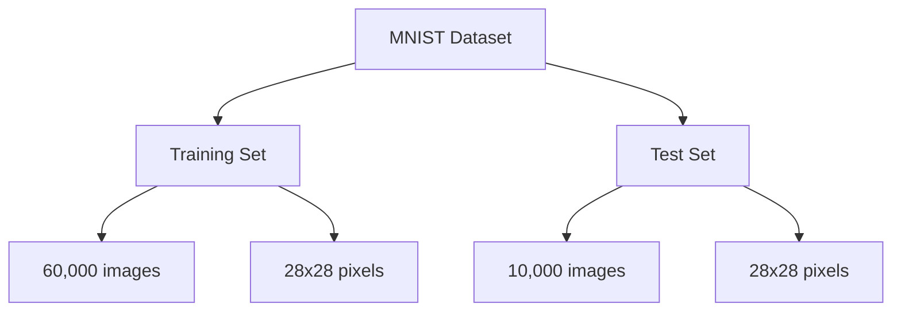
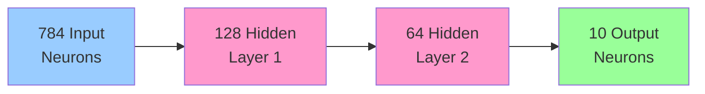
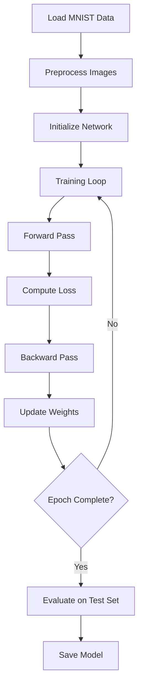

# Module 18: Handwriting Recognition 🔢

Build a digit recognizer from scratch in C!

## 📚 What You'll Learn

1. Understanding MNIST dataset
2. Image processing in C
3. Building a digit recognizer
4. Training and testing
5. Optimization techniques
6. Complete working project

## 🎯 MNIST Dataset

### Dataset Overview

The MNIST database contains:
- 60,000 training images
- 10,000 test images
- 28x28 pixel grayscale images
- Digits 0-9



### Image Representation

```c
#include <stdio.h>
#include <stdlib.h>
#include <stdint.h>

#define IMAGE_SIZE 784  // 28 * 28
#define NUM_LABELS 10

typedef struct {
    uint8_t pixels[IMAGE_SIZE];
    uint8_t label;
} MNISTImage;

// Read MNIST image file
int readMNISTImages(const char *filename, MNISTImage **images, int *num_images) {
    FILE *file = fopen(filename, "rb");
    if (!file) {
        printf("Error opening file: %s\n", filename);
        return -1;
    }
    
    // Read header
    uint32_t magic_number, num_imgs, rows, cols;
    fread(&magic_number, 4, 1, file);
    fread(&num_imgs, 4, 1, file);
    fread(&rows, 4, 1, file);
    fread(&cols, 4, 1, file);
    
    // Swap endianness if needed (MNIST uses big-endian)
    // Note: __builtin_bswap32 is GCC-specific; for portability use:
    // ((x>>24)&0xff) | ((x<<8)&0xff0000) | ((x>>8)&0xff00) | ((x<<24)&0xff000000)
    magic_number = __builtin_bswap32(magic_number);
    num_imgs = __builtin_bswap32(num_imgs);
    rows = __builtin_bswap32(rows);
    cols = __builtin_bswap32(cols);
    
    *num_images = num_imgs;
    *images = (MNISTImage*)malloc(num_imgs * sizeof(MNISTImage));
    
    // Read images
    for (int i = 0; i < num_imgs; i++) {
        fread((*images)[i].pixels, IMAGE_SIZE, 1, file);
    }
    
    fclose(file);
    return 0;
}

// Read MNIST labels
int readMNISTLabels(const char *filename, MNISTImage *images, int num_images) {
    FILE *file = fopen(filename, "rb");
    if (!file) {
        printf("Error opening file: %s\n", filename);
        return -1;
    }
    
    // Read header
    uint32_t magic_number, num_labels;
    fread(&magic_number, 4, 1, file);
    fread(&num_labels, 4, 1, file);
    
    magic_number = __builtin_bswap32(magic_number);
    num_labels = __builtin_bswap32(num_labels);
    
    // Read labels
    for (int i = 0; i < num_images && i < num_labels; i++) {
        fread(&images[i].label, 1, 1, file);
    }
    
    fclose(file);
    return 0;
}
```

## 🖼️ Image Processing

### Normalize and Preprocess

```c
// Normalize pixel values to [0, 1]
void normalizeImage(uint8_t *pixels, double *normalized) {
    for (int i = 0; i < IMAGE_SIZE; i++) {
        normalized[i] = pixels[i] / 255.0;
    }
}

// Display image in ASCII
void displayImage(uint8_t *pixels) {
    char chars[] = " .:-=+*#%@";
    for (int i = 0; i < 28; i++) {
        for (int j = 0; j < 28; j++) {
            int pixel = pixels[i * 28 + j];
            int index = pixel * 9 / 255;
            printf("%c", chars[index]);
        }
        printf("\n");
    }
}

// Extract features (simple averaging)
void extractFeatures(uint8_t *pixels, double *features, int num_features) {
    int block_size = IMAGE_SIZE / num_features;
    
    for (int i = 0; i < num_features; i++) {
        double sum = 0;
        for (int j = 0; j < block_size; j++) {
            sum += pixels[i * block_size + j];
        }
        features[i] = sum / (block_size * 255.0);
    }
}
```

## 🧠 Neural Network for Digit Recognition

### Network Architecture



### Network Implementation

```c
#include <stdio.h>
#include <stdlib.h>
#include <math.h>
#include <time.h>
#include <string.h>

#define INPUT_SIZE 784
#define HIDDEN1_SIZE 128
#define HIDDEN2_SIZE 64
#define OUTPUT_SIZE 10
#define LEARNING_RATE 0.01

typedef struct {
    // Weights
    double **w1;  // INPUT_SIZE x HIDDEN1_SIZE
    double **w2;  // HIDDEN1_SIZE x HIDDEN2_SIZE
    double **w3;  // HIDDEN2_SIZE x OUTPUT_SIZE
    
    // Biases
    double *b1;   // HIDDEN1_SIZE
    double *b2;   // HIDDEN2_SIZE
    double *b3;   // OUTPUT_SIZE
} DigitRecognizer;

DigitRecognizer* createRecognizer() {
    DigitRecognizer *dr = (DigitRecognizer*)malloc(sizeof(DigitRecognizer));
    
    // Allocate and initialize weights
    dr->w1 = (double**)malloc(INPUT_SIZE * sizeof(double*));
    for (int i = 0; i < INPUT_SIZE; i++) {
        dr->w1[i] = (double*)malloc(HIDDEN1_SIZE * sizeof(double));
        for (int j = 0; j < HIDDEN1_SIZE; j++) {
            dr->w1[i][j] = ((double)rand() / RAND_MAX) * 0.1 - 0.05;
        }
    }
    
    // Similar for w2 and w3...
    
    return dr;
}

// Forward pass
void forward(DigitRecognizer *dr, double *input, double *output) {
    double hidden1[HIDDEN1_SIZE];
    double hidden2[HIDDEN2_SIZE];
    
    // Input to Hidden1
    for (int j = 0; j < HIDDEN1_SIZE; j++) {
        hidden1[j] = dr->b1[j];
        for (int i = 0; i < INPUT_SIZE; i++) {
            hidden1[j] += input[i] * dr->w1[i][j];
        }
        hidden1[j] = relu(hidden1[j]);
    }
    
    // Hidden1 to Hidden2
    for (int j = 0; j < HIDDEN2_SIZE; j++) {
        hidden2[j] = dr->b2[j];
        for (int i = 0; i < HIDDEN1_SIZE; i++) {
            hidden2[j] += hidden1[i] * dr->w2[i][j];
        }
        hidden2[j] = relu(hidden2[j]);
    }
    
    // Hidden2 to Output
    double max = -INFINITY;
    for (int j = 0; j < OUTPUT_SIZE; j++) {
        output[j] = dr->b3[j];
        for (int i = 0; i < HIDDEN2_SIZE; i++) {
            output[j] += hidden2[i] * dr->w3[i][j];
        }
        if (output[j] > max) max = output[j];
    }
    
    // Softmax
    double sum = 0;
    for (int j = 0; j < OUTPUT_SIZE; j++) {
        output[j] = exp(output[j] - max);
        sum += output[j];
    }
    for (int j = 0; j < OUTPUT_SIZE; j++) {
        output[j] /= sum;
    }
}

// Predict digit
int predict(DigitRecognizer *dr, uint8_t *pixels) {
    double input[INPUT_SIZE];
    double output[OUTPUT_SIZE];
    
    // Normalize input
    for (int i = 0; i < IMAGE_SIZE; i++) {
        input[i] = pixels[i] / 255.0;
    }
    
    forward(dr, input, output);
    
    // Find max
    int max_idx = 0;
    double max_val = output[0];
    for (int i = 1; i < OUTPUT_SIZE; i++) {
        if (output[i] > max_val) {
            max_val = output[i];
            max_idx = i;
        }
    }
    
    return max_idx;
}
```

## 📊 Training Pipeline

### Training Process



### Training Function

```c
void train(DigitRecognizer *dr, MNISTImage *images, int num_images, 
           int epochs, int batch_size) {
    printf("Training digit recognizer...\n");
    
    for (int epoch = 0; epoch < epochs; epoch++) {
        double total_loss = 0;
        int correct = 0;
        
        for (int i = 0; i < num_images; i++) {
            double input[INPUT_SIZE];
            double output[OUTPUT_SIZE];
            double target[OUTPUT_SIZE] = {0};
            
            // Normalize input
            normalizeImage(images[i].pixels, input);
            target[images[i].label] = 1.0;
            
            // Forward pass
            forward(dr, input, output);
            
            // Compute loss (cross-entropy)
            total_loss -= log(output[images[i].label] + 1e-10);
            
            // Check accuracy
            int predicted = 0;
            for (int j = 1; j < OUTPUT_SIZE; j++) {
                if (output[j] > output[predicted]) {
                    predicted = j;
                }
            }
            if (predicted == images[i].label) correct++;
            
            // Backward pass and update weights
            // (implementation details...)
        }
        
        printf("Epoch %d: Loss = %.4f, Accuracy = %.2f%%\n", 
               epoch + 1, total_loss / num_images, 
               100.0 * correct / num_images);
    }
}
```

## 🎯 Testing and Evaluation

### Evaluation Metrics

```c
void evaluate(DigitRecognizer *dr, MNISTImage *test_images, int num_test) {
    int correct = 0;
    int confusion_matrix[10][10] = {0};
    
    printf("Evaluating on test set...\n");
    
    for (int i = 0; i < num_test; i++) {
        int predicted = predict(dr, test_images[i].pixels);
        int actual = test_images[i].label;
        
        confusion_matrix[actual][predicted]++;
        if (predicted == actual) correct++;
    }
    
    printf("Test Accuracy: %.2f%%\n", 100.0 * correct / num_test);
    
    // Print confusion matrix
    printf("\nConfusion Matrix:\n");
    printf("   ");
    for (int i = 0; i < 10; i++) printf("%4d", i);
    printf("\n");
    
    for (int i = 0; i < 10; i++) {
        printf("%2d ", i);
        for (int j = 0; j < 10; j++) {
            printf("%4d", confusion_matrix[i][j]);
        }
        printf("\n");
    }
}
```

## 📖 Complete Example

### Main Program

```c
int main() {
    srand(time(NULL));
    
    // Load MNIST data
    MNISTImage *train_images, *test_images;
    int num_train, num_test;
    
    printf("Loading MNIST dataset...\n");
    readMNISTImages("train-images.idx3-ubyte", &train_images, &num_train);
    readMNISTLabels("train-labels.idx1-ubyte", train_images, num_train);
    readMNISTImages("t10k-images.idx3-ubyte", &test_images, &num_test);
    readMNISTLabels("t10k-labels.idx1-ubyte", test_images, num_test);
    
    printf("Loaded %d training images and %d test images\n", num_train, num_test);
    
    // Create and train recognizer
    DigitRecognizer *dr = createRecognizer();
    train(dr, train_images, num_train, 10, 32);
    
    // Evaluate
    evaluate(dr, test_images, num_test);
    
    // Interactive testing
    printf("\nTesting on random images:\n");
    for (int i = 0; i < 5; i++) {
        int idx = rand() % num_test;
        printf("\nImage %d:\n", i + 1);
        displayImage(test_images[idx].pixels);
        int predicted = predict(dr, test_images[idx].pixels);
        printf("Predicted: %d, Actual: %d\n", predicted, test_images[idx].label);
    }
    
    // Cleanup
    free(train_images);
    free(test_images);
    
    return 0;
}
```

## 📖 Code Examples

1. [digit_recognizer.c](./digit_recognizer.c) - Complete digit recognizer
2. [mnist_loader.c](./mnist_loader.c) - MNIST data loader
3. [image_processing.c](./image_processing.c) - Image preprocessing
4. [network_training.c](./network_training.c) - Training utilities
5. [model_evaluation.c](./model_evaluation.c) - Evaluation and metrics

## ✏️ Exercises

1. Implement data augmentation (rotation, scaling)
2. Add convolutional layers
3. Implement early stopping
4. Save and load trained models
5. Create a web interface for digit recognition
6. Optimize using SIMD instructions
7. Implement dropout regularization
8. Try different architectures

## 🎯 Key Takeaways

- MNIST is the "Hello World" of machine learning
- Image preprocessing is crucial
- Neural networks can learn complex patterns
- Training requires careful tuning
- Evaluation metrics help assess performance
- Real-world applications need optimization

## 🔜 Next Module

Ready for simulations? Head to [Module 19: Scientific Computing](../19-scientific-computing/README.md)

---

**Pro Tip**: Start with a smaller network and smaller dataset for quick iterations!
