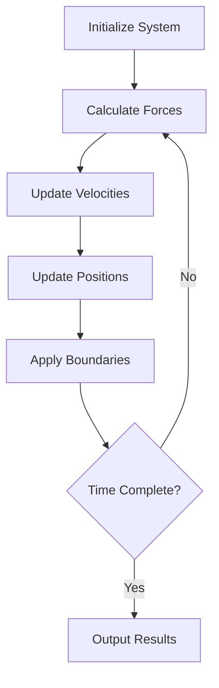
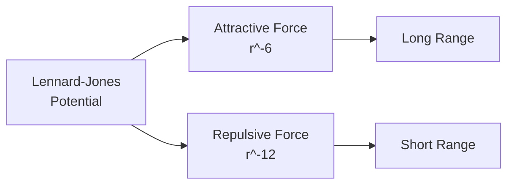

# Module 19: Scientific Computing 🔬

Explore scientific simulations and computational physics in C!

## 📚 What You'll Learn

1. Numerical methods
2. Matrix operations
3. Molecular dynamics simulations
4. Physics simulations
5. Data visualization
6. Performance optimization

## 🧪 Molecular Dynamics Simulation

### MD Simulation Overview



### Particle Structure

```c
#include <stdio.h>
#include <stdlib.h>
#include <math.h>
#include <time.h>

#define NUM_PARTICLES 100
#define BOX_SIZE 10.0
#define DT 0.001           // Time step
#define NUM_STEPS 10000    // Simulation steps

typedef struct {
    double x, y, z;        // Position
    double vx, vy, vz;     // Velocity
    double fx, fy, fz;     // Force
    double mass;
} Particle;

typedef struct {
    Particle particles[NUM_PARTICLES];
    double box_size;
    double temperature;
    double potential_energy;
    double kinetic_energy;
} System;
```

## ⚛️ Lennard-Jones Potential

### Force Calculation

The Lennard-Jones potential models intermolecular forces:

$$V(r) = 4\epsilon \left[\left(\frac{\sigma}{r}\right)^{12} - \left(\frac{\sigma}{r}\right)^6\right]$$



```c
#define EPSILON 1.0
#define SIGMA 1.0
#define CUTOFF 2.5

// Calculate Lennard-Jones force between two particles
void calculateLJForce(Particle *p1, Particle *p2, double *fx, double *fy, double *fz) {
    double dx = p1->x - p2->x;
    double dy = p1->y - p2->y;
    double dz = p1->z - p2->z;
    
    // Apply periodic boundary conditions
    dx -= BOX_SIZE * round(dx / BOX_SIZE);
    dy -= BOX_SIZE * round(dy / BOX_SIZE);
    dz -= BOX_SIZE * round(dz / BOX_SIZE);
    
    double r2 = dx*dx + dy*dy + dz*dz;
    
    if (r2 < CUTOFF * CUTOFF) {
        double r2inv = SIGMA * SIGMA / r2;
        double r6inv = r2inv * r2inv * r2inv;
        double force_magnitude = 24.0 * EPSILON * r6inv * (2.0 * r6inv - 1.0) / r2;
        
        *fx = force_magnitude * dx;
        *fy = force_magnitude * dy;
        *fz = force_magnitude * dz;
    } else {
        *fx = *fy = *fz = 0.0;
    }
}

// Calculate all forces in the system
void calculateForces(System *sys) {
    // Reset forces
    for (int i = 0; i < NUM_PARTICLES; i++) {
        sys->particles[i].fx = 0.0;
        sys->particles[i].fy = 0.0;
        sys->particles[i].fz = 0.0;
    }
    
    sys->potential_energy = 0.0;
    
    // Calculate pairwise forces
    for (int i = 0; i < NUM_PARTICLES - 1; i++) {
        for (int j = i + 1; j < NUM_PARTICLES; j++) {
            double fx, fy, fz;
            calculateLJForce(&sys->particles[i], &sys->particles[j], 
                           &fx, &fy, &fz);
            
            sys->particles[i].fx += fx;
            sys->particles[i].fy += fy;
            sys->particles[i].fz += fz;
            
            sys->particles[j].fx -= fx;
            sys->particles[j].fy -= fy;
            sys->particles[j].fz -= fz;
        }
    }
}
```

## 🔄 Velocity Verlet Integration

### Time Integration Algorithm

```mermaid
graph TD
    A[v(t+Δt/2) = v(t) + a(t)·Δt/2] --> B[x(t+Δt) = x(t) + v(t+Δt/2)·Δt]
    B --> C[Calculate Forces F(t+Δt)]
    C --> D[v(t+Δt) = v(t+Δt/2) + a(t+Δt)·Δt/2]
```

```c
void velocityVerlet(System *sys, double dt) {
    // Update velocities (half step)
    for (int i = 0; i < NUM_PARTICLES; i++) {
        Particle *p = &sys->particles[i];
        double ax = p->fx / p->mass;
        double ay = p->fy / p->mass;
        double az = p->fz / p->mass;
        
        p->vx += 0.5 * ax * dt;
        p->vy += 0.5 * ay * dt;
        p->vz += 0.5 * az * dt;
        
        // Update positions
        p->x += p->vx * dt;
        p->y += p->vy * dt;
        p->z += p->vz * dt;
        
        // Apply periodic boundary conditions
        p->x = fmod(p->x + BOX_SIZE, BOX_SIZE);
        p->y = fmod(p->y + BOX_SIZE, BOX_SIZE);
        p->z = fmod(p->z + BOX_SIZE, BOX_SIZE);
        if (p->x < 0) p->x += BOX_SIZE;
        if (p->y < 0) p->y += BOX_SIZE;
        if (p->z < 0) p->z += BOX_SIZE;
    }
    
    // Calculate new forces
    calculateForces(sys);
    
    // Update velocities (second half step)
    for (int i = 0; i < NUM_PARTICLES; i++) {
        Particle *p = &sys->particles[i];
        double ax = p->fx / p->mass;
        double ay = p->fy / p->mass;
        double az = p->fz / p->mass;
        
        p->vx += 0.5 * ax * dt;
        p->vy += 0.5 * ay * dt;
        p->vz += 0.5 * az * dt;
    }
}
```

## 📊 System Properties

### Energy and Temperature Calculations

```c
void calculateEnergies(System *sys) {
    sys->kinetic_energy = 0.0;
    
    for (int i = 0; i < NUM_PARTICLES; i++) {
        Particle *p = &sys->particles[i];
        double v2 = p->vx*p->vx + p->vy*p->vy + p->vz*p->vz;
        sys->kinetic_energy += 0.5 * p->mass * v2;
    }
    
    // Temperature from kinetic energy (3N/2 * kB * T = KE)
    sys->temperature = 2.0 * sys->kinetic_energy / (3.0 * NUM_PARTICLES);
}

double getTotalEnergy(System *sys) {
    return sys->kinetic_energy + sys->potential_energy;
}

// Radial distribution function
void calculateRDF(System *sys, double *rdf, int bins, double max_r) {
    double dr = max_r / bins;
    int *hist = (int*)calloc(bins, sizeof(int));
    
    for (int i = 0; i < NUM_PARTICLES - 1; i++) {
        for (int j = i + 1; j < NUM_PARTICLES; j++) {
            double dx = sys->particles[i].x - sys->particles[j].x;
            double dy = sys->particles[i].y - sys->particles[j].y;
            double dz = sys->particles[i].z - sys->particles[j].z;
            
            dx -= BOX_SIZE * round(dx / BOX_SIZE);
            dy -= BOX_SIZE * round(dy / BOX_SIZE);
            dz -= BOX_SIZE * round(dz / BOX_SIZE);
            
            double r = sqrt(dx*dx + dy*dy + dz*dz);
            
            if (r < max_r) {
                int bin = (int)(r / dr);
                hist[bin]++;
            }
        }
    }
    
    // Normalize
    double density = NUM_PARTICLES / (BOX_SIZE * BOX_SIZE * BOX_SIZE);
    for (int i = 0; i < bins; i++) {
        double r = (i + 0.5) * dr;
        double volume = 4.0 * M_PI * r * r * dr;
        rdf[i] = hist[i] / (volume * density * NUM_PARTICLES);
    }
    
    free(hist);
}
```

## 🎲 System Initialization

### Setting Up the Simulation

```c
void initializeSystem(System *sys) {
    sys->box_size = BOX_SIZE;
    
    // Place particles on a lattice
    int n = (int)ceil(pow(NUM_PARTICLES, 1.0/3.0));
    double spacing = BOX_SIZE / n;
    
    int idx = 0;
    for (int i = 0; i < n && idx < NUM_PARTICLES; i++) {
        for (int j = 0; j < n && idx < NUM_PARTICLES; j++) {
            for (int k = 0; k < n && idx < NUM_PARTICLES; k++) {
                Particle *p = &sys->particles[idx];
                p->x = i * spacing;
                p->y = j * spacing;
                p->z = k * spacing;
                p->mass = 1.0;
                
                // Initialize velocities (Maxwell-Boltzmann distribution)
                p->vx = ((double)rand() / RAND_MAX - 0.5) * 2.0;
                p->vy = ((double)rand() / RAND_MAX - 0.5) * 2.0;
                p->vz = ((double)rand() / RAND_MAX - 0.5) * 2.0;
                
                idx++;
            }
        }
    }
    
    // Remove center of mass motion
    double vcm_x = 0, vcm_y = 0, vcm_z = 0;
    for (int i = 0; i < NUM_PARTICLES; i++) {
        vcm_x += sys->particles[i].vx;
        vcm_y += sys->particles[i].vy;
        vcm_z += sys->particles[i].vz;
    }
    vcm_x /= NUM_PARTICLES;
    vcm_y /= NUM_PARTICLES;
    vcm_z /= NUM_PARTICLES;
    
    for (int i = 0; i < NUM_PARTICLES; i++) {
        sys->particles[i].vx -= vcm_x;
        sys->particles[i].vy -= vcm_y;
        sys->particles[i].vz -= vcm_z;
    }
}
```

## 🖥️ Complete Simulation

### Main Simulation Loop

```c
int main() {
    srand(time(NULL));
    
    System sys;
    initializeSystem(&sys);
    
    printf("Molecular Dynamics Simulation\n");
    printf("==============================\n");
    printf("Particles: %d\n", NUM_PARTICLES);
    printf("Box size: %.2f\n", BOX_SIZE);
    printf("Time step: %.4f\n", DT);
    printf("Steps: %d\n\n", NUM_STEPS);
    
    FILE *energy_file = fopen("energy.dat", "w");
    FILE *trajectory_file = fopen("trajectory.xyz", "w");
    
    // Initial force calculation
    calculateForces(&sys);
    
    // Main simulation loop
    for (int step = 0; step < NUM_STEPS; step++) {
        velocityVerlet(&sys, DT);
        calculateEnergies(&sys);
        
        // Output every 100 steps
        if (step % 100 == 0) {
            double total_energy = getTotalEnergy(&sys);
            printf("Step %d: T=%.4f, KE=%.4f, PE=%.4f, E=%.4f\n",
                   step, sys.temperature, sys.kinetic_energy,
                   sys.potential_energy, total_energy);
            
            fprintf(energy_file, "%d %.6f %.6f %.6f %.6f\n",
                   step, sys.temperature, sys.kinetic_energy,
                   sys.potential_energy, total_energy);
        }
        
        // Save trajectory every 10 steps
        if (step % 10 == 0) {
            fprintf(trajectory_file, "%d\n", NUM_PARTICLES);
            fprintf(trajectory_file, "Step %d\n", step);
            for (int i = 0; i < NUM_PARTICLES; i++) {
                fprintf(trajectory_file, "Ar %.6f %.6f %.6f\n",
                       sys.particles[i].x, sys.particles[i].y,
                       sys.particles[i].z);
            }
        }
    }
    
    fclose(energy_file);
    fclose(trajectory_file);
    
    // Calculate radial distribution function
    double rdf[100];
    calculateRDF(&sys, rdf, 100, BOX_SIZE/2);
    
    FILE *rdf_file = fopen("rdf.dat", "w");
    for (int i = 0; i < 100; i++) {
        fprintf(rdf_file, "%.4f %.6f\n", (i + 0.5) * BOX_SIZE/200, rdf[i]);
    }
    fclose(rdf_file);
    
    printf("\nSimulation complete!\n");
    printf("Output files: energy.dat, trajectory.xyz, rdf.dat\n");
    
    return 0;
}
```

## 📈 Data Visualization

### Plotting with gnuplot

```bash
# Energy vs time
gnuplot -e "set terminal png; set output 'energy.png'; 
plot 'energy.dat' u 1:2 w l title 'Temperature', 
'' u 1:5 w l title 'Total Energy'"

# Radial distribution function
gnuplot -e "set terminal png; set output 'rdf.png'; 
plot 'rdf.dat' w l title 'g(r)'"
```

## 📖 Additional Simulations

### Other Physics Simulations

1. **N-Body Problem**: Gravitational simulation
2. **Wave Equation**: 1D/2D wave propagation
3. **Heat Diffusion**: Temperature distribution
4. **Fluid Dynamics**: Lattice Boltzmann method
5. **Quantum Mechanics**: Schrödinger equation

## 📖 Code Examples

1. [molecular_dynamics.c](./molecular_dynamics.c) - Complete MD simulation
2. [matrix_operations.c](./matrix_operations.c) - Linear algebra
3. [numerical_integration.c](./numerical_integration.c) - Integration methods
4. [wave_simulation.c](./wave_simulation.c) - Wave equation solver
5. [monte_carlo.c](./monte_carlo.c) - Monte Carlo methods

## ✏️ Exercises

1. Implement temperature control (thermostat)
2. Add different potentials (Morse, Coulomb)
3. Simulate phase transitions
4. Implement neighbor lists for efficiency
5. Add visualization using OpenGL
6. Calculate diffusion coefficient
7. Implement NPT ensemble
8. Parallelize using OpenMP

## 🎯 Key Takeaways

- MD simulates atomic motion using classical mechanics
- Lennard-Jones potential models intermolecular forces
- Velocity Verlet is a stable integration method
- Periodic boundaries simulate bulk systems
- Energy conservation indicates accuracy
- RDF reveals structural properties
- Scientific computing requires careful validation

## 🔜 Next Module

Ready to polish your skills? Head to [Module 20: Professional Development](../20-professional-dev/README.md)

---

**Pro Tip**: Validate your simulation by checking energy conservation and comparing with known results!
